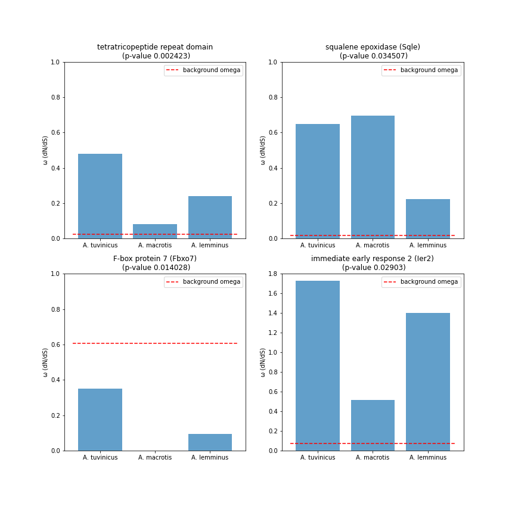

# Поиск молекулярных конвергентных замен у высокогорных грызунов

- автор: Халенёва Дарья
- под руководством: Бондарева Ольга, Петрова Татьяна, Бодров Семён

***Институт биоинформатики & Зоологический институт РАН***

## О проекте

Когда организмы попадают в новые для себя условия окружающей среды, то, со временем, начинают адаптироваться к ним, и эти адаптации спустя многие поколения можно проследить на молекулярном уровне как изменения на генетическом уровне отдельных генов или целых систем. Чтобы определить, какие именно изменения на уровне генома относятся к адаптивным, а какие - к случайным, удобно использовать модель, состоящую из нескольких близкородственных таксонов, которые приобретают адаптации к контрастным условиям окружающей среды независимо. 

Такую хорошую модельную систему предоставляют грызуны подсемейства полевочьих, благодаря тому, что эти животные за короткий срок и неоднократно заселяли самые разнообразные экологические ниши от тундры до высокогорьев. Представители двух триб подсемейства заселяют как гористые ландшафты, так и лесные зоны, адаптации происходили независимо. Проект позволит взглянуть на то, как можно отследить, какие изменения происходили на генетическом уровне у грызунов при переходе к жизни в условиях высокогорьев и в перспективе оценить, какие замены возникают у обитателей гор в ходе конвергентной эволюции, а какие независимо.

## Цель и задачи проекта

**Цель проекта:**

Выявить молекулярные адаптации грызунов к жизни в высокогорных условиях, используя транскриптомные данные.

**Задачи:**

1. Произвести сборку транскриптомов исследуемых видов

2. Осуществить поиск ортологичных генов для всех взятых в анализ грызунов

3. Отобрать универсальные однокопийные ортологи

4. Произвести оценку отбора, протестировав разные эволюционные модели

5. Отобрать гены, для которых значимо показано действие отбора у горных грызунов по сравнению с лесными

   

## Пайплайн работы

Полный пайплайн с описанием параметров запуска всех программ можно найти в файле Lab_journal.md

### Часть 1. Сборка транскриптомов, контроль качества

1. #### FastQC - первичный контроль качества, а также контроль после чистки Trimmomatic

2. #### Trimmomatic - очистка ридов плохого качества

3. #### Trinity - сборка транскриптомов

   

### Часть 2. Аннотация собранных транскриптомов

После сборки Trinity необходимо отобрать только гены, исключив химерные последовательности и псевдогены, которые могла собрать Trinity.

1. #### diamond - BLAST генов, найденных Trinity на базу NCBI NR. Необходим для обнаружения только генов из всех собранных контигов

2. #### Трансдекодер - поиск рамок считывания и трансляция генов, необходим для дальнейшей работы Proteinortho

   

### Часть 3. Поиск ортологичных генов

Когда составлены fasta файлы, содержащие только гены для каждого из взятых в анализ видов (как по нуклеотидным, так и по аминокислотным последовательностям), необходимо осуществить поиск ортологичных генов, т.е. одинаковых генов, встречающихся у всех взятых в аналих видов. Дальнейший анализ будет проводиться уже для отдельных ортогрупп

1. #### Proteinortho - составляет таблицу ортологичных генов для указанных видов

2. #### Prank - выравнивание полученных ортогрупп

   

### Часть 4. Оценка действия отбора

Для оценки действия отбора очень важно правильно подобрать группу видов, которые будут сравниваться. Нас интересуют представители одной трибы - трибы ***Clethrionomyini*** , а именно три лесных (*Clethrionomys glareolus, C. rutilus, Craseomys rufocanus*) и три горных обитателя (*Alticola lemminus,A.macrotis,A.tuvinicus*)

1. #### MrBayes - программа для построения филогении байесовским методом. Одно дерево используется для всех ортогрупп генов представителей одной трибы и указывается в ETE-toolkit evol в качестве одного из обязательных параметров.

2. #### ETE-toolkit - программа для тестирования различных моделей эволюции и поиска отбора. Необходимо указать путь к дереву, путь к ортогруппам и указать желаемые модели эволюции, которые будут протестированы.

   

### Часть 5. Результаты работы

Дерево, полученное для представителей трибы Clethrionomyini на полных митогеномных данных (Визуализация в веб-сервисе IQtree):

**Результаты поиска адаптивных замен**

Среди 251 универсального однокопийного ортолога в трибе Clethrionomyini найдено 20 генов, для которых показано действие отбора, при уровне значимости p < 0.01. 

Найденные гены (цифры для каждого вида - расчитанное значение омеги):

| orthogroup | tuvinicus | macrotis | lemminus2 | background | p-value  | models    | average_omega | BLAST гена                                                   |
| ---------- | --------- | -------- | --------- | ---------- | -------- | --------- | ------------- | ------------------------------------------------------------ |
| 33         | 0.48      | 0.08     | 0.239     | 0.024      | 0.002423 | M0/b_free | 0.07          | tetratricopeptide repeat domain                              |
| 55         | 999       | 0.197    | 0.922     | 0.227      | 0.045188 | M0/b_free | 0.297         | lipase maturation factor 2                                   |
| 59         | 0.647     | 0.694    | 0.224     | 0.018      | 0.034507 | M0/b_free | 0.136         | squalene epoxidase (Sqle)                                    |
| 60         | 0.677     | 0.247    | 0.082     | 0.038      | 0.015774 | M0/b_free | 0.08          | glycine--tRNA ligase (Gars1)                                 |
| 77         | 0.035     | 0        | 0         | 0.226      | 0.00478  | M0/b_free | 0.102         | beta-glucuronidase transcript (Gusb)                         |
| 83         | 0.13      | 0        | 0         | 0.179      | 0.01996  | M0/b_free | 0.097         | elongator complex protein 3 transcript variant X1 (Elp3)     |
| 99         | 8.963     | 0.864    | 0.633     | 0.231      | 0.00081  | M0/b_free | 0.854         | transcription elongation factor, mitochondrial (Tefm)        |
| 100        | 0.35      | 0        | 0.094     | 0.608      | 0.014028 | M0/b_free | 0.357         | F-box protein 7 (Fbxo7)                                      |
| 112        | 2.042     | 0        | 0         | 0.129      | 0.029111 | M0/b_free | 0.195         | thioredoxin related transmembrane protein 1 (Tmx1)           |
| 146        | 1.478     | 2.266    | 0         | 0.184      | 0.041966 | M0/b_free | 0.247         | reticulophagy regulator family member 3 (Retreg3)            |
| 173        | 0         | 999      | 999       | 0.354      | 0.004692 | M0/b_free | 0.413         | small nuclear RNA activating complex polypeptide 2 (Snapc2)  |
| 177        | 0.75      | 0        | 999       | 0.022      | 0.00236  | M0/b_free | 0.096         | heterogeneous nuclear ribonucleoprotein L-like (Hnrnpll)     |
| 178        | 0         | 0.818    | 0         | 0          | 0.009515 | M0/b_free | 0.076         | thymidylate kinase transcript variant X1 (Dtymk)             |
| 185        | 916.762   | 999      | 999       | 0.017      | 0.009461 | M0/b_free | 0.067         | biogenesis of lysosome-related organelles complex 1 subunit 4 (Bloc1s4) |
| 205        | 0.734     | 999      | 0.738     | 0          | 0.004302 | M0/b_free | 0.073         | 26S proteasome non-ATPase regulatory subunit 8 (Psmd8)       |
| 208        | 0         | 0        | 0.056     | 0.324      | 0.002271 | M0/b_free | 0.158         | 3-ketoacyl-CoA thiolase, mitochondrial (Acaa2)               |
| 243        | 0.874     | 0        | 0.182     | 0.022      | 0.001341 | M0/b_free | 0.121         | rhomboid domain-containing protein 2 transcript variant X1 (Rhbdd2) |
| 245        | 1.253     | 999      | 0         | 0          | 0.012813 | M0/b_free | 0.207         | NEDD4 family-interacting protein 1 (Ndfip1)                  |
| 249        | 1.731     | 0.518    | 1.401     | 0.074      | 0.02903  | M0/b_free | 0.275         | immediate early response 2 (Ier2)                            |
| 251        | 0.375     | 999      | 999       | 0.11       | 0.037962 | M0/b_free | 0.331         | zinc finger protein 282 (Znf282)                             |

В настоящее время проводится анализ найденных генов для установления их потенциальной роли в адаптации к высокорьям.

Пример генов, для которых показано действие отбора с высоким уровнем значимости:

На рисунке столбиками обозначены три горных вида каждый со своим значением омеги. Для представленных генов видно, что все три горных вида имеют пониженное (относительно фоновой группы - лесных полевочьих, красная пунктирная линия), либо повышенное значение омеги, что может говорить об адаптивности действия отбора на эти гены у горных грызунов.

### Литература

Andrews, S. (2010). **FastQC**: A Quality Control Tool for High Throughput Sequence Data [Online]

Bolger, A. M., Lohse, M., & Usadel, B. (2014). Trimmomatic: A flexible trimmer for Illumina Sequence Data. *Bioinformatics*, btu170

Buchfink B, Reuter K, Drost HG, "Sensitive protein alignments at tree-of-life scale using **DIAMOND**", Nature Methods 18, 366–368 (2021).

*ETE 3: Reconstruction, analysis and visualization of phylogenomic data.* Jaime Huerta-Cepas, Francois Serra and Peer Bork. Mol Biol Evol 2016;[ doi: 10.1093/molbev/msw046](http://mbe.oxfordjournals.org/content/early/2016/03/21/molbev.msw046)   

Grabherr MG, Haas BJ, Yassour M, Levin JZ, Thompson DA, Amit I, Adiconis X, Fan L, Raychowdhury R, Zeng Q, Chen Z, Mauceli E, Hacohen N, Gnirke  A, Rhind N, di Palma F, Birren BW, Nusbaum C, Lindblad-Toh K, Friedman N, Regev A. Full-length transcriptome assembly from RNA-seq data without a reference genome. [Nat Biotechnol. 2011 May 15;29(7):644-52](http://www.nature.com/nbt/journal/vaop/ncurrent/abs/nbt.1883.html). doi: 10.1038/nbt.1883. [PubMed PMID: 21572440](http://www.ncbi.nlm.nih.gov/pubmed/21572440).

Huelsenbeck, J. P. and F. Ronquist. 2001. MRBAYES: Bayesian inference of phylogeny. Bioinformatics 17:754-755.

Lechner, M., Findeisz, S., Steiner, L., Marz, M., Stadler, P. F., & Prohaska, S. J. (2011). Proteinortho: detection of (co-) orthologs in large-scale analysis. BMC bioinformatics, 12(1), 124.

Patro, R., Duggal, G., Love, M. I., Irizarry, R. A., & Kingsford, C. (2017). Salmon provides fast and bias-aware quantification of transcript expression. Nature Methods.

https://github.com/TransDecoder/TransDecoder/wiki

