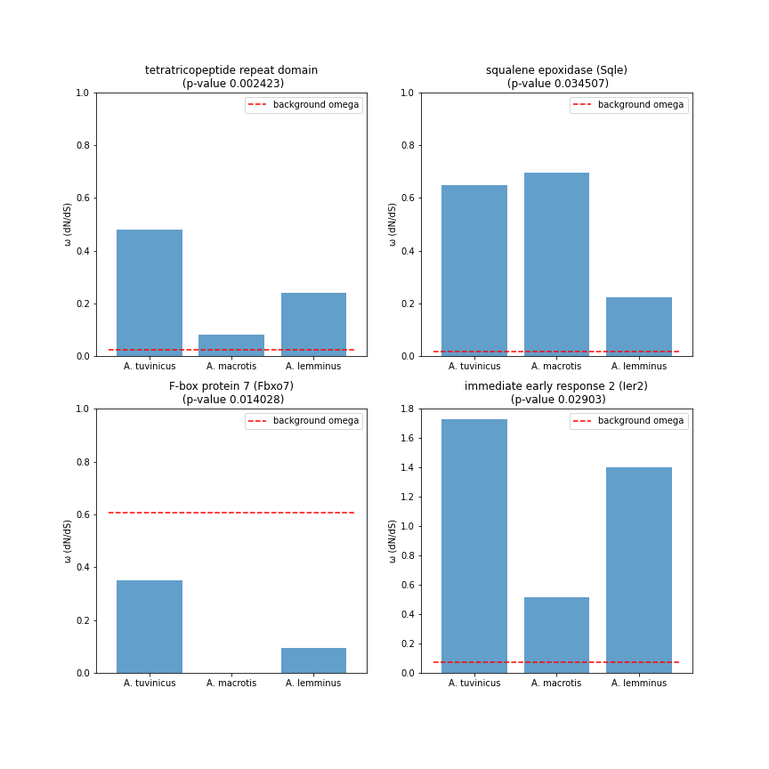

# Поиск молекулярных конвергентных замен у высокогорных грызунов

## Лабораторный журнал

- автор: Халенёва Дарья
- под руководством: Бондарева Ольга, Петрова Татьяна, Бодров Семён

***Институт биоинформатики & Зоологический институт РАН***


## Пайплайн работы

### 1. Сборка транскриптомов, контроль качества

В данном пайплайне все сырые риды, а также риды после очистки и отбора генов лежат в папке data, а все результаты работы программ сохраняются в папку results в подпапку соответствующей программы (кроме очистки и поиска генов). Все используемые скрипты лежат в папке scripts

#### 1.1 FastQC 

```bash
fastqc -o results/fastQC data/trimmed/*PE*.fastq
```

#### 1.2 Trimmomatic

запуск для консоли:

```bash
trimmomatic PE -phred33 -threads 3 data/raw/A2_S117_R1_001.fastq.gz data/raw/A2_S117_R2_001.fastq.gz data/trimmed/A2_S117_R1_PE.fastq.gz data/trimmed/A2_S117_R1_SE.fastq.gz data/trimmed/A2_S117_R2_PE.fastq.gz data/trimmed/A2_S117_R2_SE.fastq.gz ILLUMINACLIP:TruSeq2-PE.fa:2:30:10 SLIDINGWINDOW:4:15 MINLEN:60 HEADCROP:12
fastqc -o data/trimmed/FQC data/trimmed/A2_S117_R1_PE.fastq.gz
```

TruSeq2-PE убрал адаптеры наполовину

Запуск многих файлов (из папки с адаптерами, которые лежат в установленном trimmomatic в папке adapters):

```bash
for file in data/raw/*.gz
do
withpath="${file}"
filename=${withpath##*/}
base="${filename%*_*.gz}"
echo "${base}"
trimmomatic PE data/raw/"${base}"_001.fastq.gz data/raw/"${base}"_001.fastq.gz data/trimmed/"${base}".trimmed_PE.fastq data/trimmed/"${base}".trimmed_SE.fastq data/trimmed/"${base}".trimmed_PE.fastq data/trimmed/"${base}".trimmed_SE.fastq HEADCROP:12 ILLUMINACLIP:TruSeq3-PE-2.fa:2:30:10 LEADING:2 TRAILING:2 MINLEN:36
done
```

Удаление адаптеров:

```bash
for adaptors in `ls *.fa`; do base=$(basename $adaptors ".fa");
trimmomatic PE -phred33 -threads 3 data/trimmed/A10_S120_R1.trimmed_PE.fastq data/trimmed/A10_S120_R2.trimmed_PE.fastq data/trimmed2/${base}_1_PE.fastq data/trimmed2/${base}_1_SE.fastq data/trimmed2/${base}_2_PE.fastq data/trimmed2/${base}_2_SE.fastq ILLUMINACLIP:${base}:2:30:10 SLIDINGWINDOW:4:10; done
```

Итоговое качество - хорошее для всех прочтений!


#### 1.3 Trinity

##### Установка 

1. Качаем сам тринити в папку откуда будем запускать

  ```bash
wget https://github.com/trinityrnaseq/trinityrnaseq/releases/download/v2.11.0/trinityrnaseq-v2.11.0.FULL.tar.gz
tar -xf trinityrnaseq-v2.11.0.FULL.tar.gz  # разархивируем
#ВАЖНО!!! python version = 3.9.0 не работает, сработало на 3.7
#Поэтому: (скорее всего можно 3.8 тоже)
conda install python=3.7.0
  ```

2. для тринити нужны (у меня было пустое окружение):

  ```bash
conda install -c bioconda bowtie2
conda install -c bioconda jellyfish
conda install -c bioconda samtools=1.9
conda install -c bioconda salmon=1.4.0
conda install -c anaconda numpy
  ```

3. Перед запуском заходим в корневую папку где установлена тринити и там запускаем команду:

   ```bash
   make -i clean && make
   ```

##### Запуск

После установочных шагов, приведенных выше, Trinity запустилась командой:

```bash
# ЗАПУСК ДЛЯ (НЕСКОЛЬКИХ) L.LAGURUS
scripts/trinityrnaseq-v2.11.0/Trinity --seqType fq --left data/trimmed/5465_S3_R1.trimmed_PE.fastq,data/trimmed/5466_S4_R1.trimmed_PE.fastq --right data/trimmed/5465_S3_R2.trimmed_PE.fastq,data/trimmed/5466_S4_R2.trimmed_PE.fastq --max_memory 60G --output data/assembled/Trinity_lagurus
```

После этого проводим оценку качества сборки:

```bash
scripts/trinityrnaseq-v2.11.0/util/TrinityStats.pl Trinity.fasta > Clethrionomys.sp.trinity.stats.txt
```

Транскриптомы, собранные мной

- Clethrionomys.sp.trinity.fasta

- glareolus.trinity.fasta

- lemminus1.trinity.fasta

- oeconomus.trinity.fasta

- rutilus1.trinity.fasta

- tuvinicus.trinity.fasta

- agrestis.trinity.fasta

- lagurus.trinity.fasta

- macrotis.trinity.fasta

- rufocanus.trinity.fasta

- rutilus2.trinity.fasta

  

### 2. Аннотация собранных транскриптомов

#### 2.1 diamond

```bash
conda install -c bioconda diamond
>diamond version 2.0.8
```

##### Запуск

Для нуклеотидов:

```bash
diamond blastx --db nr.gz --query data/assembled/nucleotide_trinity/lemminus2.trinity.fasta --out data/annotated/by_nucl/lemminus2.diamond.tsv --max-target-seqs 1 --threads 10 -b8  -c 1 -e 0.00001
```

Для белков:

```bash
diamond blastp --db /home/DBS/nr.gz --query data/assembled/peptide_trinity/torquatus.trinity.pep.fasta --out data/annotated/by_protein/torquatus.diamond.tsv --max-target-seqs 1 --threads 10 -b8 -c 1 -e 0.00001
```

Запуск через скрипт:

```bash
python3 scripts/diamond_query.py
```

(отсюда скачиваем таксонмап если нужна):

```bash
wget ftp://ftp.ncbi.nlm.nih.gov/pub/taxonomy/accession2taxid/prot.accession2taxid.gz
taxonmap/prot.accession2taxid.gz
```

Параметры:

* `--db` позволяет выбрать базу данных для референса

* `-b` выделяет объем памяти на каждую обсчитываемую в одно время ячейку (-b2 соответствует примерно 12 Гб памяти)

* `--max-target-seqs ` если указано, алгоритм выведет только указанное количество матчей (25 по умолчанию)

* `--out` адрес и имя создаваемого файла
* `--query` последовательности для сравнения с базой

Diamond выдаст последовательности, для которых нашелся match в базе. Далее те id, для которых нашелся match, необходимо сравнить с имеющимеся и "пересечь", то есть отобрать из исходного файла только те последовательности, которые соответствуют генам.

Отфильтровать по значению e-value готовые файлы можно так:

```bash
awk '$11<=0.00000000001 {print}' amphibius.diamond.tsv 
```

На выходе с diamond имеем следующее число хитов по белкам: (wc -l) - это количество найденных для каждого вида генов

- [x] 36998 agrestis.diamond.tsv
- [x] 51351 amphibius_200.diamond.tsv
- [x] 57935 brandtii_200.diamond.tsv
- [x] 38950 Clethrionomys.diamond.tsv
- [x] 36276 fortis.diamond.tsv
- [x] 64749 glareolus2.diamond.tsv
- [x] 41336 glareolus.diamond.tsv
- [x] 33020 gregalis.diamond.tsv
- [x] 38337 griseus.diamond.tsv
- [x] 35685 lagurus.diamond.tsv
- [x] 48603 lemminus2.diamond.tsv (Танин)
- [x] 28320 lemminus.diamond.tsv
- [x] 68547 lutescens_200.diamond.tsv
- [x] 49772 macrotis.diamond.tsv
- [x] 58167 mandarinus.diamond.tsv
- [x] 37770 nivalis.diamond.tsv
- [x] 37766 ochrogaster.diamond.tsv
- [x] 74671 oeconomus.diamond.tsv
- [x] 46559 pennsylvanicus.diamond.tsv
- [x] 46181 raddei.diamond.tsv
- [x] 45762 rufocanus.diamond.tsv
- [x] 58466 rutilus1_300.diamond.tsv
- [x] 62660 rutilus2.diamond.tsv
- [x] 46527 schaposchnikowi.diamond.tsv
- [x] 41376 schisticolor.diamond.tsv
- [x] 42172 sibiricus.diamond.tsv
- [x] 64878 subterraneus.diamond.tsv
- [x] 25659 torquatus.diamond.tsv
- [x] 20606 tuvinicus.diamond.tsv
- [x] 33565 zibethicus.diamond.tsv

### 2.2 Трансдекодер

```bash
conda install -c bioconda transdecoder
TransDecoder.LongOrfs  # поиск рамок считывания
TransDecoder.Predict  # предсказание, какие из рамок считывания могут соответствовать генам
```

Ищет открытые рамки считывания. Его нужно прогнать на собранных тринити транскриптомах чтобы получить последовательности пептидов. Они нужны, так как с ними в дальнейшем будет работать proteinortho.

#### Запуск

Переходим в папку с файлом assembly.trinity.fasta, куда тринити положила его после сборки

запускаем поиск самых длинных рамок считывания:

```bash
TransDecoder.LongOrfs -t assembly.trinity.fasta
```

он создаст много папочек где будут лежать координаты рамок и сиквенсы как нуклеотидные так и пептидные. Теперь над нашим же исходным фаста файлом можно запускать предикт, он найдет предпологаемые гены:

```bash
TransDecoder.Predict -t assembly.trinity.fasta
```

Файл с пептидными последовательностями будет *transdecoder*.pep

##### Сопоставление сборки и отбластенных id

Далее нужно "пересечь" полученные заголовки (id) последовательностей (которые нашел diamond) с самими последовательностями из исходной сборки, чтобы получить итоговый фаста файл, где содержатся только гены.

ИНТЕРСЕКТ:

```bash
grep -F -A 1 -f 'ids' 'lin.fastas.fa' > intersected.fa
sed '/^-/d' intersected.fa > final.fa
```

ВНИМАНИЕ! ФАЙЛЫ ОЧЕНЬ БОЛЬШИЕ, ПОЭТОМУ ВЫТЯГИВАЕМ ЧЕРЕЗ samtools:

```bash
# (аминокислотные)
awk '{print $1}' data/annotated/by_protein/mandarinus.diamond.tsv | xargs samtools faidx data/assembled/peptide_trinity/mandarinus.trinity.fasta > data/clean_genes/peptides/mandarinus.genes.fasta

# (нуклеотидные)
awk -F '.' '{print $1}' data/annotated/by_protein/lemminus2.diamond.tsv | xargs samtools faidx data/assembled/nucleotide_trinity/lemminus_trinity.fasta > data/clean_genes/nucleotide/mountains/lemminus2.genes.nucl.fasta
```


### 3. Поиск ортологичных генов

#### 3.1 Proteinortho

Proteinortho is a tool to detect orthologous genes within different species.

```bash
conda install -c bioconda proteinortho 
>version 6.0.28
```


##### Запуск

из папки results/proteinortho

```bash
proteinortho ../../data/clean_genes/peptides/mountains/*.fasta -project=mountain_ortho -cpus=15 -verbose=2 -clean
```

Получили сводную табличку с ортологами для 14-ти файлов:

- [x] lemminus2.genes.fasta

- [x] rufocanus.genes.fastф

- [x] macrotis.genes.fasta

- [x] tuvinicus.genes.fasta

- [x] glareolus.genes.fasta

- [x] rutilus2.genes.fasta

- [x] nivalis.genes.fasta

- [x] ochrogaster.genes.fasta

- [x] brandtii.genes.fasta

- [x] mandarinus.genes.fasta

- [x] gregalis.genes.fasta

- [x] raddei.genes.fasta 

- [x] fortis.genes.fasta

- [x] pennsylvanicus.genes.fasta

  табличка выглядит примерно так (уже отфильтрована по условию количество генов = количество видов для поиска только универсальных однокопийных ортологов):

|      | # Species | Genes | Alg.-Conn. | brandtii.genes.fasta         | fortis.genes.fasta          | glareolus.genes.fasta        | gregalis.genes.fasta        | lemminus2.genes.fasta       | macrotis.genes.fasta        | mandarinus.genes.fasta      | nivalis.genes.fasta         | ochrogaster.genes.fasta | pennsylvanicus.genes.fasta  | raddei.genes.fasta          | rufocanus.genes.fasta       | rutilus2.genes.fasta        | tuvinicus.genes.fasta       |
| ---- | --------- | ----- | ---------- | ---------------------------- | --------------------------- | ---------------------------- | --------------------------- | --------------------------- | --------------------------- | --------------------------- | --------------------------- | ----------------------- | --------------------------- | --------------------------- | --------------------------- | --------------------------- | --------------------------- |
| 2921 | 14        | 14    | 0.523      | TRINITY_DN5388_c0_g1_i2.p1   | TRINITY_DN1328_c0_g1_i1.p1  | TRINITY_DN8415_c0_g1_i2.p1   | TRINITY_DN3568_c0_g3_i1.p1  | TRINITY_DN13995_c0_g1_i1.p1 | TRINITY_DN12476_c1_g1_i1.p1 | TRINITY_DN5464_c0_g1_i2.p1  | TRINITY_DN16439_c1_g1_i1.p1 | XP_005365546.1          | TRINITY_DN6560_c0_g1_i1.p1  | TRINITY_DN7213_c0_g1_i1.p1  | TRINITY_DN96757_c0_g1_i1.p1 | TRINITY_DN9950_c0_g1_i3.p1  | TRINITY_DN11305_c0_g1_i2.p1 |
| 2922 | 14        | 14    | 0.516      | TRINITY_DN1242_c0_g1_i23.p1  | TRINITY_DN3746_c0_g1_i10.p1 | TRINITY_DN2495_c0_g1_i3.p1   | TRINITY_DN2119_c0_g1_i2.p1  | TRINITY_DN2105_c0_g1_i3.p1  | TRINITY_DN928_c0_g1_i2.p1   | TRINITY_DN1597_c2_g1_i8.p1  | TRINITY_DN1008_c0_g1_i1.p1  | XP_005362054.1          | TRINITY_DN8853_c0_g1_i9.p1  | TRINITY_DN1316_c0_g1_i2.p1  | TRINITY_DN2156_c0_g1_i2.p1  | TRINITY_DN4665_c0_g3_i2.p1  | TRINITY_DN2498_c0_g1_i2.p1  |
| 2923 | 14        | 14    | 0.515      | TRINITY_DN1066_c6_g1_i1.p1   | TRINITY_DN5_c0_g6_i1.p1     | TRINITY_DN276_c2_g1_i2.p1    | TRINITY_DN1170_c2_g1_i2.p1  | TRINITY_DN854_c2_g1_i1.p1   | TRINITY_DN1373_c0_g2_i2.p1  | TRINITY_DN191_c5_g1_i2.p1   | TRINITY_DN517_c2_g1_i1.p1   | XP_005371696.1          | TRINITY_DN7189_c0_g3_i1.p1  | TRINITY_DN697_c4_g1_i1.p1   | TRINITY_DN3676_c2_g1_i1.p1  | TRINITY_DN2007_c2_g2_i1.p1  | TRINITY_DN1995_c7_g1_i1.p1  |
| 2924 | 14        | 14    | 0.513      | TRINITY_DN7256_c0_g1_i7.p1   | TRINITY_DN3662_c0_g3_i2.p1  | TRINITY_DN10739_c0_g1_i3.p1  | TRINITY_DN19184_c0_g1_i1.p1 | TRINITY_DN20199_c0_g1_i1.p1 | TRINITY_DN10903_c1_g3_i1.p1 | TRINITY_DN1211_c21_g1_i3.p1 | TRINITY_DN3541_c0_g1_i1.p1  | XP_005358460.1          | TRINITY_DN3233_c0_g7_i1.p1  | TRINITY_DN16851_c0_g1_i1.p1 | TRINITY_DN80875_c0_g1_i1.p1 | TRINITY_DN22122_c0_g1_i1.p1 | TRINITY_DN4208_c0_g1_i1.p1  |
| 2925 | 14        | 14    | 0.512      | TRINITY_DN2545_c2_g1_i1.p1   | TRINITY_DN26542_c0_g1_i1.p1 | TRINITY_DN3504_c1_g1_i3.p1   | TRINITY_DN1733_c0_g1_i1.p1  | TRINITY_DN2066_c1_g1_i1.p1  | TRINITY_DN45526_c0_g1_i1.p1 | TRINITY_DN1510_c5_g1_i1.p1  | TRINITY_DN562_c0_g4_i1.p1   | XP_005366515.1          | TRINITY_DN2627_c1_g2_i1.p1  | TRINITY_DN3623_c1_g2_i1.p1  | TRINITY_DN2884_c0_g1_i2.p1  | TRINITY_DN6836_c0_g1_i1.p1  | TRINITY_DN1456_c0_g2_i1.p1  |
| 2926 | 14        | 14    | 0.507      | TRINITY_DN11297_c0_g1_i3.p1  | TRINITY_DN54557_c0_g1_i1.p1 | TRINITY_DN76663_c0_g1_i1.p1  | TRINITY_DN4143_c0_g1_i1.p1  | TRINITY_DN13271_c0_g2_i1.p1 | TRINITY_DN76577_c0_g1_i1.p1 | TRINITY_DN6742_c0_g1_i3.p1  | TRINITY_DN7883_c0_g1_i1.p1  | XP_026643801.1          | TRINITY_DN9107_c0_g1_i1.p1  | TRINITY_DN19557_c0_g1_i1.p1 | TRINITY_DN6725_c0_g1_i1.p1  | TRINITY_DN2624_c0_g1_i2.p1  | TRINITY_DN6627_c0_g1_i1.p1  |
| 2927 | 14        | 14    | 0.504      | TRINITY_DN10297_c0_g1_i4.p1  | TRINITY_DN18193_c0_g2_i1.p1 | TRINITY_DN5628_c0_g1_i8.p1   | TRINITY_DN18811_c0_g1_i1.p1 | TRINITY_DN1920_c0_g1_i2.p1  | TRINITY_DN2965_c0_g2_i1.p1  | TRINITY_DN7871_c0_g1_i3.p1  | TRINITY_DN227_c1_g3_i1.p1   | XP_005353120.1          | TRINITY_DN7648_c0_g1_i1.p1  | TRINITY_DN18920_c0_g1_i1.p1 | TRINITY_DN2671_c0_g1_i3.p1  | TRINITY_DN3725_c0_g1_i1.p1  | TRINITY_DN6441_c0_g1_i1.p1  |
| 2928 | 14        | 14    | 0.504      | TRINITY_DN43533_c0_g1_i2.p1  | TRINITY_DN724_c5_g2_i1.p1   | TRINITY_DN33074_c1_g1_i1.p1  | TRINITY_DN1433_c1_g2_i3.p2  | TRINITY_DN1193_c3_g1_i1.p1  | TRINITY_DN989_c1_g4_i1.p1   | TRINITY_DN5355_c2_g1_i5.p1  | TRINITY_DN1724_c1_g1_i1.p1  | XP_005358816.1          | TRINITY_DN23296_c0_g1_i1.p1 | TRINITY_DN1468_c4_g1_i1.p1  | TRINITY_DN22391_c0_g1_i5.p1 | TRINITY_DN20789_c0_g1_i1.p1 | TRINITY_DN1214_c3_g1_i1.p1  |
| 2929 | 14        | 14    | 0.502      | TRINITY_DN103548_c0_g1_i1.p1 | TRINITY_DN35795_c0_g2_i1.p1 | TRINITY_DN141849_c0_g1_i2.p1 | TRINITY_DN7826_c0_g1_i1.p1  | TRINITY_DN5629_c0_g1_i1.p1  | TRINITY_DN489_c0_g2_i2.p1   | TRINITY_DN4895_c0_g1_i1.p1  | TRINITY_DN22835_c0_g1_i1.p1 | XP_005351458.1          | TRINITY_DN4412_c0_g1_i3.p1  | TRINITY_DN5063_c1_g3_i1.p1  | TRINITY_DN5110_c0_g1_i4.p1  | TRINITY_DN7238_c0_g1_i1.p1  | TRINITY_DN1360_c0_g1_i1.p1  |

Нам нужно теперь вытащить сами гены. Для этого:

1. фильтруем результат протеинорто таким образом чтобы оставить только те гены, которых для каждого вида нашлось по 1 штуке (любым простым скриптом на bash/R/Python, я в пандасе отсортировала и сохранила новую табличку) - УНИВЕРСАЛЬНЫЕ ОДНОКОПИЙНЫЕ ОРТОЛОГИ

2. Из исходной сборки trinity вытягиваем нуклеотидные фасты для генов, на них будем считать отбор

3. для каждой ортогруппы (там где присутствуют все 14 видов)  вытягиваем ортологичные гены с помощью скрипта (make_orthogroup_genes.py)

4. В полученных файликах могут оказаться дубликаты, поэтому убираем их с помощью seqkit rmdup (можно в цикле для всех сразу):

   ```bash
    for f in *.fasta; do seqkit rmdup "$f" > deduplicated/"${f%.*}.fa"; done
   ```

РЕЗУЛЬТАТ:

получили 251 файл - это ортогруппы, в каждой из них один единственный ген для всех 14ти видов

#### 3.2 Выравнивание

- Стартовый пайплайн (вышел плохо):

Выравнивала mafft, вышло плохо, гены очень сильно разорвало. Поэтому выравнивала prank-ом (wget ). Выравнивала исходные транскрипты целиком

```bash
for f in *.fa; do prank -d="$f" -o=results/proteinortho/aligned_genes/"${f%.*}_ali.fa" -codon; done

#ПРОГОН ЧЕРЕЗ GBLOCKS для чистки выравнивания
for f in *.fas; do /home/usr/programms/Gblocks_0.91b/Gblocks "$f" -s results/proteinortho/aligned_gb_ortho_genes/"${f%.*}.fa" -g; done
```

- **НОВЫЙ ПАЙПЛАЙН**

Выравнивать будем не просто вытащенные нуклеотидные последовательности, а непосредственно CDS. Пайплайн усовершенствован в связи с 1) плохой работой Gblocks (рамка считывания для большинства генов уничтожена из-за некачественного выравнивания исходных транскриптов) 2) плохой работой Ete на выравниваниях без Gblocks и на выравниваниях после Gblocks. НАБЛЮДЕНИЕ: часто ген находится на (-) цепи, и выравнивается очень плохо!!!

Поэтому:

```bash
 # скачаем поисковик рамок считывания от NCBI (можно и трансдекодером, а можно так)
 wget https://ftp.ncbi.nlm.nih.gov/genomes/TOOLS/ORFfinder/linux-i64/ORFfinder.gz
 gzip -d ORFfinder.gz
 # принимает на вход мультифасту и выдает список всех ORF во всех последовательностях (во всех направлениях ищет)
 scripts/ORFfinder -in 2.fa -ml 190 -outfmt 1 -out results/proteinortho/ORFs/2_CDS.fa
```

```
 -ml - минимальная длина рамки
 -outfmt <Integer>
   Output options:
       0 = list of ORFs in FASTA format
       1 = CDS in FASTA format
       2 = Text ASN.1
       3 = Feature table
```

подробнее на https://ftp.ncbi.nlm.nih.gov/genomes/TOOLS/ORFfinder/USAGE.txt

Прогоняем все файлы через него:

```bash
for f in results/proteinortho/aligned_genes/; do scripts/ORFfinder -in "$f" -ml 200 -outfmt 1 -out results/proteinortho/ORFs/"${f%.*}_CDS.fa"; done
```

В полученных файлах нас будет интересовать только самая длинная ORF для каждого вида в ортогруппе. Поэтому необходимо дополнительно причесать аутпут (скрипт /CDS_id_cleaner.py, запускается изнутри 1 раз)

На выходе имеем чистые кодирующие регионы для каждого гена каждого вида в каждой из 251 ортогрупп.

Пример выходного файла после скрипта: (таких 251 по количеству ортогрупп)

| >rutilus2<br/>ATGGCGGAGGCACCTCCGGTCTCAGGCACTTTTAAATTCAGTACAGATGCTGCTGAGTTCATTCCTCAGGAGAGAAAAAATTCTGGTCTAAATTGTGGGACCCAAAGAAGACTAGACTCTAGGATTGGCAGAAGAAATTACAGTTCCTCACCTCCCTGTCACCTTCCCAGGCAGAATCCTTACGATGACATCTCTGCTATTCATCAGCACAGTTACGCCTCTGGAAGCAAACCTAGGAGTCAACAGGTGTTTTTCCAGTCTTCTAATAAATCACTCAAGAACCATGGCCTTCACAATCAGCCATGGCAGAAGTTGAGGAATGAAAAACACCAAAGCAGAGTCAAGAAAGCACAAGGGCTCACTGACCAGACGTCGGATACATCCAGTTTAGAAAGTGTGACCAGGTCAGAGAGTGGAGCAGACCCTAGGGAGCATAGCCCTTCTGAGAGTGAGAAAGATGTGGTTATTGCAGATCCTAGGGGAGCAAAGCCCAAAAAGGCAGCACAGCTTATATACAACTATGGCAGAGGACCAAAGGCCAAAGGGAAGCTCAAATGTGAGCTGGGTAATAGAATGAGCCCGAAGTCTGAGGATGAAAACACCAGACCTGTGGGGGCTTCTCAGACTGACTTTTCAGATGTGTCCTGTAGAAAGGCTGTAGTGGATGGCTGCATGTCAAGACGGAATGAGCAGAGAAGATACCCACAGAAAAGGCCTCCCTGGGAGGTGGAGGGTGCCAGACCACGACCAGGCAGGAACCCACCAAAACAGGAAAGTCAGCGACATATAAATTCAGGGCCTAAAAACAACATGCCCACCATCCCAAAGGATAATCTCAGAGAAAGACCAACAAAGTCAGCCTGTGACACTGGGAATTTGGCCGTTGTCAACAAGTCTTCCAGAAGGGTTGACCAAGAGAAGAATGCAGGAAGGAGACAGGACCCTCAAGTGCTCTCTGCTTTCCCCAGAGGCAAACAGAACCATGTGTTGAAGAATGTGGAAACACATACAGGTTCACTAATTGAGCAGCTAACTACAGAAAAATACGAATGCATGGTGTGCTGTGAATTGGTTCAAGTTACAGCCCCGGTGTGGAGCTGTCAGAGCTGTTTTCACGTCTTTCATTTGAACTGCATCAAGAAGTGGGCCCGGTCTCCAGCATCTCATGCAGATGGCCAGAGTGGTTGGAGGTGCCCTGCTTGTCAGAATGTTTCTGCACATGTTCCTAATACCTATACTTGTTTCTGTGGTAAAGTAAAGAATCCTGAATGGAGCAGAAATGAAATTCCACATAGTTGTGGTGAGGTTTGTAGGAAGAAGCAGCCTGGCCAGGACTGTCCACATTCCTGTAACCTTCTCTGCCATCCTGGACCCTGCCCTCCCTGCCCTGCTTTTACAACTAAAGCATGTGAATGTGGACGCACCAGACACACAGTTCGCTGTGGTCAGGCTGTCTCAGTCCACTGTTCTAACGCATGTGAGAATATTTTGAACTGTGGTCAGCACCACTGTGCTGAGCTGTGCCATGGGGGTCAGTGCCAGCCTTGCCGGATCATATTAAATCAGGTGTGCTACTGTGGCAGCACCTCCCGAGACGTGTTATGTGGAACAGACGTGGGAAAATCTGATGGATTTGGGGACTTCAGCTGTTTAAAGATATGTGGCAAGGACTTGAAATGTGGGAACCATACCTGTTCTCAAGTGTGCCACCCTCAGCCTTGTCAGCCTTGCCCACGGCTCCCCCACTTGGTGCGATGTTGCCCTTGTGGCCAAACACCTCTCAGCCAGTTACTGGAACTTGGAAGTAATGGTCGGAAAACATGCATGGATCCTGTCCCTTCATGTGGAAAAGTGTGTGGCAAACCCTTGTCCTGTGGCTCCTCAGATTTCATCCATACCTGTGAGAAGCTCTGCCATGAAGGGGACTGCGGACCATGCTCTCGCACGTCAGTCATTTCCTGCAGGTGCTCTTTCAGGACAAAGGAGCTTCCATGTACCAGTCTTAAAAGTGAAGATGCTACATTTATGTGTGACAAGCGGTGTAACAAGAAACGATTATGTGGCCGGCATAAATGTAACGAGATATGCTGTGTGGACAAGGAGCACAAGTGTCCTTTGATTTGTGGGAGAAAGCTCCGTTGTGGCCTTCATCGGTGTGAAGAACCTTGTCATCGAGGGAACTGTCAGACCTGCTGGCAAACCAGTTTTGATGAATTAACCTGCCACTGCGGCGCCTCTGTGATCTACCCACCAGTCCCCTGTGGAACTCGGCCTCCTGAGTGTACCCAGACCTGCGCCAGAGTCCATGAATGTGACCATCCAGTGTATCATTCTTGTCATAGTGAGGAGAAGTGTCCCCCCTGTACCTTCCTAACTCAGAAGTGGTGCATGGGCAAGCATGAGCTACGAAGCAACATCCCCTGTCACCTGGTTGATATCTCTTGCGGATTACCCTGCAGTGCCATGCTACCCTGCGGGATGCACAAATGTCAAAGACTCTGTCACAAAGGAGAATGTCTTGTGGACGAGGCCTGCAAGCAGCCCTGTACCACCCCCAGAGCTAGCTGTGGCCACCCATGTATGGCACCCTGCCACCCCAGTTCACCCTGCCCTGTGACAGCTTGTAAAGCCAAGGTAGAGTTACAGTGTGAATGTGGGAGAAGAAAAGAAATGGTGATCTGCTCGGAAGCGTCCGGCACCTATCACAGAATAGCTGCTATTTCTATGGCCTCTAAAATAATGGACATGCAGCTGGGAGATTCAGTGGAGATCAGCAAGTTCATTACCAAGAAGGAAGTCCAGCAAGCCAGGTTGCAGTGTGACGAGGAATGCTCTGCTCTGGAAAGGAGAAAGAGGTTGGCAGAGGCGTTTGACATCAGTGACGATTCTGATCCTTTCAATGTTCGTTCTGCAGCATCAAAGTTCAGTGACAGTTTGAAAGATGACGCCAGGAAAGACTTGAAGTTTGTCAGTGACGTTGAGAAGGAAATGGAAGCACTCGTGGAGGCTGTGGATAAGGGAAAGAGTAATAAGAAAAGCCACTGCTTCCCCCCCATGAACAGAGACCACCGCCGCATCATCCATGACCTGGCCCAAGTCTATGGCCTGGAGAGCGTGAGCTATGACAGTGAACCAAAACGCAATGTCGTGGTCACTGCAGTCAGAGGGAAGTCCATTTGTCCTCCCACCACGCTGACCAGTGTGCTTGAGAAGGAAACTCAGACGCGGCCTCCACCGCCAATTGCTCATCACCGACACCAGGCAGACAAGAATCCTGGGAGTAACAGTTTACAGAAGATAGCTAAGGAGCCCGTGATCGACTACTTTGATGTCCAGGACTGA<br/>>brandtii<br/>ATGGCGGAGGCACCTCCGGTCTCAGGCACTTTTAAATTCAGTACAGATGCTGCTGAGTTCATTCCTCAGGAGAGAAGAAATTCTGGTCTGAATTGTGGGACCCAAAGAAGACTAGACTCTAGGATTGGGAGAAGAAATTACAGTTTCTCACCTCCCTGTCACCTTCCCAGGCAGAATCCTTACGATGACATCTCTGCTATTCATCAGCACAATTACGCCTCTGGAAGCAAACCCAAGAGTCACCAGGTGTTTTTCCAGTCTAATAAATCACTCAAGAACCATGGCCTTCACAATCAGCCATGGCAGAAGTTGAGGAATGAAAAACACCAAAGCAGAGTCAAGAAAGCACAAGGGCTCACCGACCAGACGTCAGATGCGTCCAGTTTAGAAAGTGTGAGCAGGTCAGAGAGTGGAGTAGACCTTAGGGAGCACAGCCCTTCTGAGAGTGAGAAAGACGTGGTTACTGCAGATCCTAGGGGAGCAAAGCCCAAAAAGGCAGCACAGCTTACATACAACTATGGCAGAGGGCCAAAGGCCAAAGGGAAGCCCAAATGCGAGCTGGGTAGTAGAATGAGCCCGAAGTCTGAGGATGAAAACACCAGACCTGTGGGGGCTTCCCAGACTGACTTTTCAGATGCGTCCTGTAGAAAGGCTGTAGTGGATAGCTGCGTGTCGAGACGGAACGAGCAGAGAAGATACCCACAGAAAAGGCCTCCGTGGGAGGTGGAGGGTGCCAGACCACGACCAGGCAGGAACCCACCCAAACAGGAAAGTCAGCGACATTTAAATTCAGGGCCTAAAAACAACATGCCCCCCATTCCAAAGGATAATCTCAGAGAAAGACCAACAAAGTCAGCCTGTGACACTGGGAATTTGGCCGTTGTCAACAAGTCTTCCAGAAGGGTTGACCAAGAGAAGAATGCAGGAAGGAGACAGGACCCTCAAGTGCTCTCTTCTTTCCCCAGAGGCAAACAGAGCCATGTGCTGAAGAATGTGGAAACACATACAGGTTCCCTAATTGAGCAGCTAACTACAGAAAAATATGAATGTATGGTGTGCTGTGAACTGGTTCAAGTTACAGCCCCAGTGTGGAGCTGCCAGAGCTGTTTCCACGTCTTTCATTTGAACTGCATCAAGAAGTGGGCCCGGTCTCCAGCATCTCATGCAGATGGCCAGAGTGGTTGGAGGTGCCCTGCTTGTCAGAATGTTTCTGCACATGTTCCTAATACTTATACTTGTTTCTGTGGTAAAGTAAAGAATCCTGAATGGAGCAGAAATGAAATTCCACATAGTTGTGGTGAGGTTTGTAGGAAGAAACAGCCTGGCCAGGACTGTCCACATTCCTGTAACCTTCTCTGCCATCCTGGACCCTGCCCGCCCTGCCCTGCTTTTACAACTAAAGCATGTGAATGTGGACGCACCAGGCACACAGTTCGTTGTGGTCAGGCTGTCTCAGTCCACTGTTCTAACGTGTGTGAAAATATTTTGAACTGTGGTCAACACCACTGTGCTGAGCTGTGCCATGGGGGTCAGTGCCAGCCTTGCCGGATCATATTAAACCAGATGTGCTACTGTGGCAGCACCTCCCGAGATGTGTTATGTGGAACAGAAGTGGGGAAATCTGATGGATTTGGGGACTTCAGCTGTTTAAAGATATGTGGCAAGGACTTGAAATGTGGGAGCCATACCTGTTCTCAAGTGTGCCACCCTCAGCCTTGTCAGCCTTGCCCACGGCTCCCCCATTTGGTGCGATGTTGCCCTTGTGGCCAAACACCTCTCAGCCAGTTACTGGAACTTGGAAGTAATGGTCGGAAAACATGCATGGATCCTGTCCCTTCGTGTGGAAAAGTGTGTGGCAAACCCTTGTCCTGTGGTTCCTCAGATTTCATCCATACCTGTGAGAAGCTCTGCCATGAAGGAGACTGTGGACCATGCTCTCGCACGTCAGTCATTTCCTGCAGATGCTCTTTCAGGACAAAGGAGCTTCCGTGTACCAGTCTTAAAAGTGAAGATGCTACATTTATGTGTGACAAGCGGTGTAACAAGAAACGATTGTGTGGCCGGCATAAATGTAACGAGATATGCTGTGTGGACAAGGAGCACAAGTGTCCTTTGATTTGTGGGAGGAAGCTCCGTTGTGGCCTTCATCGGTGTGAAGAACCTTGTCATCGAGGGAACTGTCAGACCTGCTGGCAAACCAGTTTTGATGAATTAACCTGCCACTGTGGCGCCTCTGTGATCTACCCACCAGTCCCCTGTGGAACTAGGCCTCCCGAGTGTACTCAGACCTGTGCCAGAGTCCACGAATGTGACCATCCAGTGTATCATTCTTGTCATAGTGAGGAGAAGTGTCCCCCCTGTACCTTCTTAACTCAGAAGTGGTGCATGGGCAAGCATGAGCTACGAAGCAACATCCCCTGTCACCTGGTTGATATCTCTTGCGGATTACCCTGCAGTACCATGCTGCCCTGCGGGATGCACAAATGTCAAAGACTCTGTCACAGAGGAGAATGTCTTGTGGACGAGGCCTGCAAACAGCCCTGTACCACCCCCAGAGCTAACTGTGGCCACCCATGTATGGCACCCTGCCACCCCAGTTCACCCTGCCCTGTGACAGCTTGTAAAGCCAAGGTAGAGTTACAGTGTGAATGTGGGAGAAGAAGAGAAATGGTGATCTGCTCGGAAGCGTCCGGCACCTATCACAGAATAGCTGCTATTTCTATGGCCTCTAAAATAATGGACATGCAGCTGGGAGATTCAGTGGAGATCAGCAAGTTCATTACCAAGAAGGAAATCCAGCAAGCCAGGTTGCAGTGTGACGAGGAGTGCTCTGCTCTGGAAAGGAGAAAGAGGTTGGCAGAGGCTTTTGACATCAGTGAAGATTCTGATCCTTTTAATGTTCGTTCTTCAGCATCCAAGTTCAGTGACAGTTTGAAAGATGACGCCAGGAAAGACTTAAAGTTTGTCAGTGACGTTGAGAAGGAAATGGAAGCACTTGTGGAGGCTGTGGAGAAAGGAAAGAGCAATAAGAAAAGCCACTGCTTCCCCCCCATGAACAGAGACCACCGCCGCATCATCCACGATCTGGCCCAAGTCTATGGCCTGGAGAGCGTGAGCTACGACAGTGAACCAAAGCGCAATGTCGTGGTCACTGCAGTCAGAGGGAAGTCCATTTGTCCTCCCACCACGCTGACCAGTGTGCTTGAGAAGGAAACTCAGACGCGGCCTCCACCACCAATTGCTCATCACCGACACCAGGCAGACAAGAATCCTGGGAGCAGTAGTTTGCAGAAGATAGCTAAGGAGCCAGTGATCGACTACTTTGATGTCCAGGACTGA<br/>>tuvinicus<br/>ATGGCGGAGGCACCTCCGGTCTCAGGCACTTTTAAATTCAGTACAGATGCTGCTGAGTTCATTCCTCAGGAGAGAAAAAATTCTGGTCTAAATTGTGGGACCCAAAGAAGACTAGACTCTAGGATTGGCAGAAGAAATTACAGTTCCTCACCTCCCTGTCACCTTCCCAGGCAGAACCCTTACGATGACATCTCTGCTATTCATCAGCACAATTATGCCTCTGGAAGCAAACCTAAGAGTCAACAGGTGTTTTTCCAGTCTTCTAATAAATCACTCAAGAACCATGGCCTTCACAGTCAGCCATGGCAGAAGTTGAGGAATGAAAAACACCAAAGCAGAGTCAAGAAAGCACAAGGGCTCACTGACCAGACGTCGGATACATCCAGTTTAGAAAGTGTGACCAGGTCAGAGAGTGGAGCAGACCCTAGGGAGCATAGCCCTTCTGAGAGTGAGAAAGATGTGGTTATTGCAGATCCTAGGGGAGCAAAGCCCAAAAAGGCAGCACAGCTTATATACAACTATGGCAGAGGACCAAAGGCCAAAGGGAAGCTCAAATGTGAGCTGGGTAATAGAATGAGCCCGAAGTCTGAGGATGAAAACACCAGACCTGTGGGGGCTTCCCAGACTGACTTTTCAGATGTGTCCTGTAGAAAGGCTGTAGTGGATGGCTGCATGTCAAGACGGAATGAGCAGAGAAGATACCCACAGAAAAGGCCTCCCTGGGAGGTGGAGGGTGCCAGACCACGACCAGGCAGGAACCCACCAAAACAGGAAAGTCAGCGACATATAAATTCAGGGCCTAAAAACAACATGCCCACCATTCCAAAGGATAATCTCAGAGAAAGACCAACAAAGTCAGCCTGTGACACTGGGAATTTGGCCGTTGTCAACAAGTCTTCCAGAAGGGTTGACCAAGAGAAGAATGCAGGAAGGAGACAGGACCCTCAAGTGCTCTCTGCTTTCCCCAGAGGCAAACAGAACCATGTGTTGAAGAATGTGGAAACACATACAGGTTCGCTAATTGAGCAGCTAACTACAGAAAAATACGAATGTATGGTGTGCTGTGAATTGGTTCAAGTTACAGCCCCAGTGTGGAGCTGTCAGAGCTGTTTTCACGTCTTTCATTTGAACTGCATCAAGAAGTGGGCCCGGTCTCCAGCATCTCATGCAGATGGCCAGAGTGGTTGGAGGTGCCCTGCTTGTCAGAATGTTTCTGCACATGTTCCTAATACCTATACTTGTTTCTGTGGTAAAGTAAAGAATCCTGAATGGAGCAGAAATGAAATTCCACATAGTTGTGGTGAGGTTTGTAGGAAGAAACAGCCTGGCCGGGACTGTCCACATTCCTGTAACCTTCTCTGCCATCCTGGACCCTGCCCACCCTGCCCTGCTTTTACAACTAAAGCATGTGAATGTGGACGCACCAGACACACAGTTCGCTGTGGTCAGGCTGTCTCAGTCCACTGTTCTAACGTATGTGAGAATATTTTGAACTGTGGTCAGCACCACTGTGCTGAGCTGTGCCATGGGGGTCAGTGCCAGCCTTGCCGGATCATATTAAATCAGGTGTGCTACTGTGGCAGCACCTCCCGAGACGTGTTATGTGGAACAGACGTGGGAAAATCTGATGGATTTGGGGACTTCAGCTGTTTAAAGATATGTGGCAAGGACTTGAAATGTGGGAACCATACCTGTTCTCAAGTGTGCCACCCTCAGCCTTGTCAACCTTGCCCACGGCTCCCCCACTTGGTGCGATGTTGCCCTTGTGGCCAAACACCTCTCAGCCAGTTACTGGAACTTGGAAGTAATGGTCGGAAAACATGCATGGATCCTGTCCCTTCGTGTGGAAAAGTGTGTGGCAAACCCTTGTCCTGTGGCTCCTCAGATTTCATCCATACCTGTGAGAAGCTCTGCCATGAAGGGGACTGCGGACCATGCTCTCGCACGTCAGTCATTTCCTGCAGATGCTCCTTCAGGACAAAGGAGCTTCCATGTACCAGTCTTAAAAGTGAAGATGCTACATTTATGTGTGACAAGCGGTGTAACAAGAAACGATTATGTGGCCGGCATAAATGTAACGAGATATGCTGTGTGGACAAGGAGCACAAGTGTCCTTTGATTTGTGGGAGAAAGCTCCGTTGTGGCCTTCATCGGTGTGAAGAACCTTGTCATCGAGGGAACTGTCAGACCTGCTGGCAAACCAGTTTTGATGAATTAACCTGCCACTGTGGCGCTTCTGTGATCTACCCACCAGTCCCCTGTGGAACTCGGCCTCCTGAGTGTACCCAGACCTGTGCCAGAGTCCATGAATGTGACCATCCAGTGTATCATTCTTGTCATAGTGAGGAGAAGTGTCCCCCCTGTACCTTCCTAACTCAGAAGTGGTGCATGGGCAAGCATGAGCTACGGAGCAACATTCCCTGTCACCTGGTTGATATCTCTTGCGGATTACCCTGCAGTGCCACGCTACCCTGCGGGATGCACAAATGTCAAAGACTCTGTCACAAAGGAGAATGTCTTGTGGACGAGGCCTGCAAGCAGCCCTGTACCACCCCCAGAGCTAGCTGTGGCCACCCATGTATGGCACCCTGCCACCCCAGTTCACCCTGCCCTGTGACAGCTTGTAAAGCCAAGGTAGAGTTACAGTGTGAATGTGGGAGAAGAAAAGAAATGGTGATCTGCTCGGAAGCGTCCGGCACCTATCACAGAATAGCTGCTATTTCTATGGCCTCTAAAATAATGGACATGCAGCTGGGAGATTCAGTGGAGATCAGCAAGTTCATTACCAAGAAGGAGGTCCAGCAAGCCAGGTTGCAGTGTGACGAGGAATGCTCTGCTCTGGAAAGGAGAAAGAGGTTGGCAGAAGCGTTTGATATCAGTGACGATTCTGATCCTTTCAATGTTCGTTCTGCAGCATCAAAGTTCAGTGACAGTTTGAAAGATGACGCCAGGAAAGACTTGAAGTTTGTCAGTGACGTTGAGAAGGAAATGGAAGCACTCGTGGAGGCTGTGGATAAGGGAAAGAGTAATAAGAAAAGCCACTGCTTCCCCCCCATGAACAGAGATCACCGCCGCATCATCCATGACCTGGCCCAAGTCTATGGCCTGGAGAGCGTGAGCTATGACAGTGAACCAAAACGCAATGTTGTGATCACTGCAGTCAGAGGGAAGTCCATTTGTCCTCCCACCACGCTGACCAGTGTGCTTGAGAAGGAAACTCAGACGCGGCCTCCACCGCCAATTGCTCATCACCGACACCAGGCAGACAAGAATCCTGGGAGCAGCAGTTTACAGAAGATAGCTAAGGAGCCCATGATCGACTACTTTGATGTCCAGGACTGA<br/>>rufocanus<br/>CTGGCGGGGCTCGCTGGAGGTGCTGCGGCACAGCACGGGATGGCGGAGGCACCTCCGGTCTCAGGCACTTTTAAATTCAGTACAGATGCTGCTGAGTTCATTCCTCAGGAGAGAAAAAATTCTGGTCTAAATTGTGGGACCCAAAGAAGACTAGACTCTAGGATTGGCAGAAGAAATTACAGTTCCTCACCTCCCTGTCACCTTCCCAGGCAGAATCCTTACGATGACATCTCTGCTGTCCATCAGCACAATTACGCCTCTGGAAGCAAACCTAAGAGTCAACAGGTGTTTTTCCAGTCTTCTAATAAATCACTCAAGAACCATGGCCTTCACAATCAGCCATGGCAGAAGTTGAGGAATGAAAAACACCAAAGCAGAGTCAAGAAAGCACAAGGACTCACTGACCAGACGTCGGATACATCCAGTTTAGAAAGTGTGACCAGGTCAGAGAGTGGAGCAGACCCTAGGGAGCATAGCCCTTCTGAGAGTGAGAAAGATGTGGTTATTGCAGATCCTAGGGGAGCAAAGCCCAAAAAGGCAGCACAGCTTATATACAACTATGGCAGAGGACCAAAGGCCAAAGGGAAGCTCAAGTATGAGCTGGGTAATAGAATGAGCCCGAAGTCTGAGGATGAAAACACCAGGCCTGTGGGGGCTTCCCAGACTGACTTTTCAGATGTGTCCTGTAGAAAGGTTGTAGTGGATGGCTGCATGTCAAGACGGAATGAGCAGAGAAGATACCCACAGAAAAGGCCACCCTGGGAGGTGGAGGGTGCCAGACCACGACCAGGCAGGAACCCACCAAAACAGGAAAGTCAGCGACATATAAATTCAGGGCCTAAAAACAACATGCCCACCATTCCAAAGGATAATCTCAGAGAAAGACCAACAAAGTCAGCCTGTGACACTGGGAATTTGACCGTTGTCAACAAGTCTTCCAGAAGGGTTGACCAAGAGAAGAATGCGGGAAGGAGACAGGACCCTCAAGTGCTCTCTGCTTTCCCCAGAGGCAAACAGAATCATGTGCTGAAGAATGTGGAAACACATACAGGTTCGCTAATTGAGCAGCTAACTACAGAAAAATATGAATGTATGGTGTGCTGTGAATTGGTTCAAGTTACAGCCCCAGTGTGGAGCTGTCAGAGCTGTTTTCACGTCTTTCATTTGAATTGCATCAAGAAGTGGGCCCGGTCTCCAGCATCTCATGCAGATGGCCAGAGTGGTTGGAGGTGCCCTGCTTGTCAGAATGTTTCTGCACATGTTCCTAATACCTATACTTGTTTCTGTGGTAAAGTAAAGAATCCTGAATGGAGCAGAAATGAAATTCCACATAGTTGTGGTGAGGTTTGTAGGAAGAAACAGCCTGGCCAGGACTGTCCACATTCCTGTAACCTTCTCTGCCATCCTGGACCCTGCCCGCCCTGCCCTGCTTTTACAACTAAAGCATGTGAATGTGGACGCACTAGACACACAGTTCGCTGTGGTCAGGCTGTCTCGGTCCACTGTTCTAACACATGTGAGAATATTTTGAACTGTGGTCAGCACCACTGTGCTGAGCTTTGCCATGGGGGTCAGTGCCAGCCTTGCCGGATCATATTAAACCAGGTGTGCTACTGTGGCAGCACCTCCCGAGACGTGTTATGTGGAACAGACGTGGGAAAATCTGATGGATTTGGGGACTTCAGCTGTTTAAAGATATGTGGCAAGGACTTGAAATGTGGGAACCATACCTGTTCTCAAGTGTGCCACCCTCAACCTTGTCAGCCTTGCCCACGGCTCCCCCACTTGGTGCGATGTTGCCCTTGTGGCCAAACACCTCTCAGCCAGTTACTGGAACTTGGAAGTAATGGTCGGAAAACATGCATGGATCCTGTCCCTTCGTGTGGAAAAGTGTGTGGCAAACCTTTGTCCTGTGGCTCCTCAGATTTCATCCATACCTGTGAGAAGCTCTGCCATGAAGGAGACTGTGGACCATGCTCTCGCACGTCAGTCATTTCCTGCAGATGCTCTTTCAGGACAAAGGAGCTTCCATGTACCAGTCTTAAAAGTGAAGATGCTACATTTATGTGTGACAAGCGGTGTAACAAGAAGCGATTATGTGGCCGGCATAAATGTAACGAGATATGCTGTGTGGACAAGGAGCACAAGTGTCCTTTGATTTGTGGGAGAAAGCTCCGTTGTGGCCTTCATCGGTGTGAAGAACCTTGTCATCGAGGGAACTGTCAGACCTGCTGGCAAACCAGTTTTGATGAATTAACCTGCCACTGTGGCGCCTCTGTGATCTACCCACCAGTCCCCTGTGGAACTCGGCCTCCTGAGTGTACCCAGACCTGTGCCAGAGTCCATGAATGTGACCATCCAGTGTATCATTCTTGTCATAGTGAGGAGAAGTGTCCCCCCTGTACCTTCCTAACTCAGAAGTGGTGCATGGGCAAGCATGAGCTACGAAGCAACATCCCCTGTCACCTGGTTGATATCTCTTGCGGATTACCCTGCAGTGCCATGCTACCCTGCGGGATGCACAAATGTCAAAGACTCTGTCACAAAGGAGAATGTCTTGTGGACGAGGCCTGCAAGCAGCCCTGTACCACCCCCAGAGCTAGCTGTGGCCACCCATGTATGGCACCCTGCCACCCCAGTTCACCCTGCCCTGTGACAGCTTGTAAAGCCAAGGTAGAGTTACAGTGTGAATGTGGGAGAAGAAAAGAAATGGTGATCTGCTCGGAAGCGTCCGGCACCTATCACAGAATAGCTGCTATTTCTATGGCCTCTAAAATAATGGACATGCAGCTGGGAGATTCGGTGGAGATCAGCAAGTTCATTACCAAGAAGGAAGTCCAGCAAGCCAGGTTGCAGTGTGACGAGGAATGCTCTGCTCTGGAAAGGAGAAAGAGGTTGGCAGAGGCGTTTGACATCAGTGACGATTCTGATCCTTTCAATGTTCGTTCTGCAGCGTCAAAGTTCAGCGACAGTTTGAAAGATGACGCCAGGAAAGACTTAAAGTTTGTCAGTGACGTTGAGAAGGAAATGGAAGCACTTGTGGAGGCTGTGGATAAGGGAAAGAGTAATAAGAAAAGCCACTCCTTCCCCCCCATGAACAGAGACCATCGCCGCATCATCCATGACCTGGCCCAAGTCTATGGCCTGGAGAGCGTGAGCTATGACAGTGAACCAAAACGCAATGTCGTGGTCACTGCAGTC<br/>>mandarinus<br/>ATGGCGGAGGCACCTCCGGTCTCAGGCACTTTTAAATTCAGTACAGATGCTGCTGAATTCATTCCTCAGGAGAGAAGAAATTCTGGTCTGAATTGTGGGACCCAAAGAAGACTAGACTCTAGGATTGGGAGAAGAAATTACAGTTTCTCACCTCCCTGTCACCTTCCCAGGCAGAATCCTTACGATGACATCTCTGCTATTCATCAGCACAATTACGCCTCTGGAAGCAAACCCAAGAGTCACCAGGTGTTTTTCCAGTCTAATAAATCACTCAAGAACCATGGCCTTCACAATCAGCCATGGCAGAAGTTGAGGAATGAAAAACACCAAAGCAGAGTCAAGAAAGCACAAGGGCTCACCGACCAGACGTCAGATGCGTCCAGTTTAGAAAGTGTGAGCAGGTCAGAGAGTGGAGTAGACCTTAGGGAGCACAGCCCTTCTGAGAGTGAGAAAGACGTGGTTACTGCAGATCCTAGGGGAGCAAAGCCCAAAAAGGCAGCACAGCTTACATACAACTATGGCAGAGGGCCAAAGGCCAAAGGGAAGCCCAAATGCGAGCTGGGTAGTAGAATGAGCCCGAAGTCTGAGGATGAAAACACCAGACCTGTGGGGGCTTCCCAGACTGACTTTTCAGATGCGTCCTGTAGAAAGGCTGTAGTGGATAGCTGCATGTCGAGACGGAACGAGCAGAGAAGATACCCACAGAAAAGGCCTCCGTGGGAGGTGGAGGGTGCCAGACCACGACCAGGCAGGAACCCACCCAAACAGGAAAGTCAGCGACATTTAAATTCAGGGCCTAAAAACAACATGCCCCCCATTCCAAAGGATAATCTCAGAGAAAGACCAACAAAGTCAGCCTGTGACACTGGGAATTTGGCCATTGTCAACAAGTCTTCCAGAAGGGTTGACCAAGAGAAGAATGCAGGAAGGAGACAGGACCCTCAAGTGCTCTCTTCTTTCCCCAGAGGCAAACAGAGCCATGTGCTGAAGAATGTGGAAACACATACAGGTTCCCTAATTGAGCAGCTAACTACAGAAAAGTATGAATGTATGGTGTGCTGTGAACTGGTTCAAGTTACAGCCCCAGTGTGGAGCTGCCAGAGCTGTTTCCACGTCTTTCATTTGAACTGCATCAAGAAGTGGGCCCGGTCTCCAGCGTCTCATGCAGATGGCCAGAGTGGTTGGAGGTGCCCTGCTTGTCAGAATGTTTCTGCACATGTTCCTAATACTTATACTTGTTTCTGTGGTAAAGTAAAGAATCCTGAATGGAGCAGAAATGAAATTCCACATAGTTGTGGTGAGGTTTGTAGGAAGAAACAGCCTGGCCAGGACTGTCCACATTCCTGTAACCTTCTCTGCCATCCTGGACCCTGCCCGCCCTGCCCTGCTTTTACAACTAAAGCATGTGAATGTGGACGCACCAGGCACACAGTTCGCTGTGGTCAGGCTGTCTCAGTCCACTGTTCTAACGTGTGTGAAAATATTTTGAACTGTGGTCAACACCACTGTGCTGAGCTGTGCCATGGGGGTCAGTGCCAGCCTTGCCGGATCATATTAAACCAGATGTGCTACTGTGGCAGCACCTCCCGAGATGTGTTATGTGGAACAGAAGTGGGGAAATCTGATGGATTTGGGGACTTCAGCTGTTTAAAGATATGTGGCAAGGACTTGAAATGTGGGAGCCATACCTGTTCTCAAGTGTGCCACCCTCAGCCTTGTCAGCCTTGCCCACGGCTCCCCCATTTGGTGCGATGTTGCCCTTGTGGCCAAACACCTCTCAGCCAGTTACTGGAACTTGGAAGTAATGGTCGGAAAACATGCATGGATCCTGTCCCTTCGTGTGGAAAAGTGTGTGGCAAACCCTTGTCCTGTGGTTCCTCAGATTTCATCCATACCTGTGAGAAGCTCTGCCATGAAGGAGACTGTGGACCATGCTCTCGCACGTCAGTCATTTCCTGCAGATGCTCTTTCAGGACAAAGGAGCTTCCGTGTACCAGTCTTAAAAGTGAAGATGCTACATTTATGTGTGACAAGCGGTGTAACAAGAAACGATTGTGTGGCCGGCATAAATGTAACGAGATATGCTGTGTGGACAAGGAGCACAAGTGTCCTTTGATTTGTGGGAGGAAGCTCCGTTGTGGCCTTCATCGGTGTGAAGAACCTTGTCATCGAGGGAACTGTCAGACCTGCTGGCAAACCAGTTTTGATGAATTAACCTGCCACTGTGGCGCCTCTGTGATCTACCCACCAGTCCCCTGTGGAACTAGGCCTCCCGAGTGTACTCAGACCTGTGCCAGAGTCCACGAATGTGACCATCCAGTGTATCATTCTTGTCATAGTGAGGAGAAGTGTCCTCCCTGTACCTTCTTAACTCAGAAGTGGTGCATGGGCAAGCATGAGCTACGAAGCAACATCCCCTGTCACCTGGTTGATATCTCTTGCGGATTACCCTGCAGTACCATGCTGCCCTGCGGGATGCACAAATGTCAAAGACTCTGTCACAGAGGAGAATGTCTTGTGGACGAGGCCTGCAAACAGCCCTGTACCACCCCCAGAGCTAACTGTGGCCACCCATGTATGGCACCCTGCCACCCCAGTTCACCCTGCCCTGTGACAGCTTGTAAAGCCAAGGTAGAGTTACAGTGTGAATGTGGGAGAAGAAGAGAAATGGTGATCTGCTCGGAAGCGTCCGGCACCTATCACAGAATAGCTGCTATTTCTATGGCCTCTAGAATAATGGACATGCAGCTGGGAGATTCAGTGGAGATCAGCAAGTTCATTACCAAGAAGGAAGTCCAGCAAGCCAGGTTGCAGTGTGACGAGGAGTGCTCTGCTCTGGAAAGGAGAAAGAGGTTGGCAGAGGCTTTTGACATCAGTGAAGATTCTGATCCTTTCAATGTTCGTTCTTCAGCATCCAAGTTCAGTGACAGTTTGAAAGATGACGCCAGGAAAGACTTAAAGTTTGTCAGTGACGTTGAGAAGGAAATGGAAGCACTGGTGCAGGCTGTGGAGAAAGGAAAGAGCAATAAGAAAAGCCACTGCTTCCCCCCCATGAACAGAGACCACCGCCGCATCATCCACGATCTGGCCCAAGTCTATGGCCTGGAGAGCGTGAGCTACGACAGTGAACCAAAGCGCAATGTCGTGGTCACTGCAGTCAGAGGGAAGTCCATTTGTCCTCCCACCACGCTGACCAGTGTGCTTGAGAAGGAAACTCAGACGCGGCCTCCACCGCCAATTGCTCATCACCGACACCAGGCAGACAAGAATCCTGGGAGCAGTAGTTTGCAGAAGATAGCTAAGGAGCCAGTGATCGACTACTTTGATGTCCAGGACTGA<br/>>nivalis<br/>CTGGCGGGGCTCGCTCGAGGTGCTGCGGCACAGCACGGGATGGCGGAGGCACCTCCGGTCTCAGGCACTTTTAAATTCAGTACAGATGCTGCTGAGTTCATTCCTCAGGAGAGAAGAAATTCTGGTCTGAATTGTGGGACCCAAAGAAGACTAGACTCTAGGATTGGGAGAAGAAATTACAGTGTCTCACCTCCCTGTCACCTTCCCAGGCAGAATCCTTACGATGACATCTCTGCTATTCATCAGCACAGTTACGCCTCTGGAAGCAAACCCAAGAGTCACCAGGTGTTTTTCCAGTCTAATAAATCACTCAAGAACCATGGCCTTCACAATCAGCCATGGCAGAAGTTGAGGAATGAAAAACACCAAAGCAGAGTCAAGAAAGCACAAGGGCTCACTGACCAGACGTCAGATGCGTCCAGTTTAGAAAGTGTGACCAGGTCAGAGAGTGGAGCAGACCTTAGGGAGCATAGCCCTTCTGAGAGTGAGAAAGACGTGGTTATTGCAGATCCTAGGGGAGCAAAGCCCAAAAAGGCAGCACAGTTTACATACAACTATGGCAGAGGGCCAAAGGCCAAAGGGAAGCCCAAATGCGAGCTGGGTAGTAGAATGAGCCCGAAGTCTGAGGACGAAAGCACCAGACCCGTGGGGGCTTCCCAGGCTGACTTTTCAGATGCGTCCTGTAGAAAGGCTGTAGTGGATGGCTGCGTGTCGAGACGGAGCGAGCAGAGAAGATACCCACAGAAAAGGCCTCCGTGGGAGGTGGAGGGTGCCAGACCACGACCAGGCAGGAACCCACCCAAACAGGAAAGTCAGCGACATTTAAATTCAGGGCCTAAAAACAACATGCCCCCCATTCCAAAGGATAATCTCAGAGAAAGACCAACAAAGTCAGCCTGTGACACCGGAAATTTGGCCGTTGTCAACAAATCTTCCAGAAGGGTTGACCAAGAGAAGAATGCAGGAAGGAGACAGGACCCTCAAGTGCTCTCTCCATTCCCCAGAGGCAAACAGAGCCATGTGCTGAAGAATGTGGAAACACATACAGGTTCCCTAATTGAGCAGCTAACTACAGAAAAATACGAATGTATGGTGTGCTGTGAATTGGTTCAAGTTACAGCCCCGGTGTGGAGCTGTCAGAGCTGTTTTCACGTCTTTCATTTGAACTGTATCAAGAAGTGGGCCCGGTCTCCAGCATCTCATGCAGATGGCCAGAGTGGTTGGAGGTGCCCTGCTTGTCAGAATGTTTCTGCACATGTTCCTAATACTTATACTTGTTTCTGTGGTAAAGTAAAGAATCCTGAATGGAGCAGAAATGAAATTCCACATAGTTGTGGTGAGGTTTGTAGGAAGAAACAGCCTGGCCAGGACTGTCCACATTCCTGTAACCTTCTCTGCCATCCTGGACCCTGCCCACCCTGCCCTGCTTTTACAACTAAAGCATGTGAATGTGGACGCACCAGGCACACAGTTCGCTGTGGTCAGGCTGTCTCAGTCCACTGTTCTAACACATGTGAGAATATTTTGAACTGTGGTCAACACCACTGTACTGAGCTGTGCCATGGGGGTCAGTGCCAGCCTTGCCGGATCATATTAAACCAGGTGTGCTACTGTGGCAGCACCTCCCGAGATGTGCTATGTGGAACAGAAGTGGGGAAATCTGATGGATTTGGGGACTTCAGCTGTTTAAAGATATGTGGCAAGGACTTGAAATGTGGGAACCATACCTGTTCTCAAGTGTGCCACCCTCAGCCTTGTCAGCCTTGCCCACGGCTCCCCCATTTGGTGCGATGTTGCCCTTGTGGCCAAACACCTCTCAGCCAGTTACTGGAACTTGGAAGTAATGGTCGGAAAACATGCATGGATCCTGTCCCTTCATGTGGAAAAGTGTGTGGCAAACCCTTGTCCTGTGGTTCCTCAGATTTCATCCATACCTGTGAGAAGCTCTGCCATGAAGGAGACTGTGGACCATGCTCTCGTACGTCAGTCATTTCCTGCAGATGCTCTTTCAGGACAAAGGAGCTTCCGTGTACCAGTCTTAAAAGTGAAGATGCTACATTTATGTGTGACAAGCGGTGTAACAAGAAACGATTGTGTGGCCGGCATAAATGTAACGAGATATGCTGTGTGGACAAGGAGCACAAGTGTCCTTTGATTTGTGGGAGGAAGCTCCGTTGTGGCCTTCATCGGTGTGAAGAACCTTGTCATCGAGGGAACTGTCAGACCTGCTGGCAAACCAGTTTTGATGAATTAACCTGCCACTGTGGCGCCTCTGTGATCTACCCACCAGTCCCCTGTGGAACTAGGCCTCCTGAGTGTACTCAGACCTGTGCCAGAGTCCACGAATGTGACCATCCAGTGTATCATTCTTGTCATAGTGAGGAGAAGTGTCCCCCCTGTACCTTCTTAACTCAGAAGTGGTGCATGGGCAAGCATGAGTTACGAAGCAACATCCCCTGTCATCTGGTTGATATCTCTTGCGGATTACCCTGCAGTGCCGTGCTACCCTGCGGGATGCACAAATGTCAAAGACTCTGTCACAGAGGAGAATGTCTTGTGGACGAGGCCTGCAAGCAGCCCTGTACCACCCCCAGAGCTAACTGTGGCCACCCATGTATGGCACCCTGCCACACCAGTTCACCCTGCCCTGTGACAGCTTGTAAAGCCAAGGTAGAGTTACAGTGTGAATGTGGGAGAAGAAAAGAAATGGTGATCTGTTCCGAAGCATCCGGCACCTATCACAGAATAGCTGCTATTTCTATGGCCTCTAAAATAATGGACATGCAGCTGGGAGATTCAGTGGAGATCAGCAAGTTCATTACCAAGAAGGAAGTCCAACAAGCCAGGTTGCAGTGTGACGAGGAGTGCTCTGCTCTGGAAAGGAGAAAGAGGTTGGCAGAGGCTTTTGACATCAGTGACGATTCTGATCCTTTCAATGTTCGCTCTTCAGCATCCAAGTTCAGTGACAGTTTGAAAGATGACGCCAGGAAAGACTTAAAGTTTGTCAGTGACGTTGAGAAGGAAATGGAAGCACTTGTGGAGGCTGTGGATAAGGGAAAGAGCAATAAGAAAAGCCACTGCTTCCCCCCCATGAACAGAGACCACCGCCGCATCATCCATGACCTGGCCCAAGTCTATGGCCTGGAGAGCGTGAGCTACGACAGTGAACCAAAGCGCAATGTCGTGGTTACTGCAGTCAGAGGGAAGTCCATTTGTCCTCCCACCACACTGACCAGTGTGCTTGAGAAGGAAACTCAGACGCGGCCTCCACCGCCAATTGCTCATCACCGACACCAGGCAGACAAGAATCCTGGGAGCAGTAGTTTACAGAAGATAGCTAAGGAGCCAGTGATCGACTACTTTGATGTTCAGGACTGA<br/>>fortis<br/>ATGGCGGAGGCACCTCCGGTCTCAGGCACTTTTAAATTCAGTACAGATGCTGCTGAGTTCATTCCTCAGGAGAGAAGAAATTCTGGTCTGAACTGTGGGACCCAAAGAAGACTAGACTCTAGGATTGGGAGAAGAAATTACAGTTTCTCACCTCCCTGTCACCTTCCCAGGCAGAATCCTTACGATGACATCTCTGCTATTCATCAGCACAATTACGCCTCTGGAAGCAAACCCAAGAGTCACCAGGTGTTTTTCCAGTCTAATAAATCACTCAAGAACCATGGCCTTCACAATCAGCCATGGCAGAAGTTGAGGAATGAAAAACACCAAAGCAGAGTCAAGAAAGCACAAGGGCTCACTGACCAGACGTCAGATGCGTCCAGTTTAGAAAGTGTGACCAGGTCAGAGAGTGGAACAGACCTTAGGGAGCATAGCCCTTCTGAGAGTGAGAAAGATGTGGTTATTGCAGATCCTAGGGGAGCAAAGCCCAAAAAGGCAGCACAGCTTACATACAACTATGGCAGAGGGCCAAAGGCCAAAGGGAAGCCCAAATGCGAGCTGGGTAGTAGAATGAGCCCAAAGTCTGAGGATGAAAACACCAGACCTGTGGGGGCTTCCCAGACTGACTTTTCAGATGGGTCCTGTAGAAAGGCTGTAGTGGATAGCTGCATGTCGAGGCGGAATGAGCAGAGAAGATACCCACAGAAAAGGCCTCCGTGGGAGGTGGAGGGTGCCAGACCACGACCAGGCAGGAACCCACCCAAACAGGAAAGTCAGCGACATTTAAATTCAGGGCCTAAAAACAACATGCCCCCCATTCCAAAGGATAATCTCAGAGAAAGACCATCAAAGTCAGCCTGTGACACCGGGAATTTGGCCGTTGTCAACAAGTCTTCCAGAAGGGTTGACCAAGAGAAGAATGCAGGAAGGAGACAGGACCCTCAAGTGCTCTCTCCTTTCCCCAGAGGCAAACAGAGCCATGTGCTGAAGAATGTGGAAACACATACAGGTTCCCTAATTGAGCAGCTAACTACAGAAAAATATGAATGTATGGTGTGCTGTGAATTGGTTCAAGTTACAGCCCCAGTGTGGAGCTGTCAGAGCTGTTTTCACGTCTTTCATTTGAACTGCATCAAGAAGTGGGCCCGGTCTCCAGCATCTCATGCAGATGGCCAGAGTGGTTGGAGATGCCCTGCTTGTCAGAATGTTTCCGCACATGTTCCTAATGCTTATACTTGTTTCTGTGGTAAAGTAAAGAATCCTGAATGGAGCAGAAATGAAATTCCACATAGTTGTGGTGAGGTTTGTAGGAAGAAACAGCCTGGCCAGGACTGTCCACATTCCTGTAACCTTCTCTGCCATCCTGGACCCTGCCCGCCCTGCCCTGCTTTTACAACTAAAGCATGTGAATGTGGACGCACCAGGCACACAGTTCGCTGTGGTCAGGCTGTCTCAGTCCACTGTTCTAACGTGTGTGAAAATATTTTGAACTGTGGTCAACACCACTGTGCTGAGCTGTGCCATGGGGGTCAGTGCCAGCCTTGCCGGATCATATTAAACCAGATGTGCTACTGTGGCAGCACCTCCCGAGATGTGTTATGTGGAACAGAAGTGGGGAAATCTGATGGATTTGGGGACTTCAGCTGTTTAAAGATATGTGGCAAGGACTTGAAATGTGGGAACCATACCTGTTCTCAAGTGTGTCACCCTCAGCCTTGTCAGCCTTGCCCACGGCTCCCCCATTTGGTGCGATGTTGCCCTTGTGGCCAAACACCTCTCAGCCAGTTACTGGAACTTGGAAGTAATGGTCGGAAAACATGCATGGATCCTGTCCCTTCGTGTGGAAAAGTGTGTGGCAAACCCTTGTCCTGTGGTTCCTCAGATTTCATCCATACCTGTGAGAAGCTCTGCCATGAAGGAGACTGTGGGCCATGCTCTCGCACGTCAGTCATTTCCTGCAGATGCTCTTTCAGGACAAAGGAGCTTCCGTGTACCAGTCTTAAAAGTGAAGATGCTACATTTATGTGTGACAAGCGGTGTAACAAGAAACGATTGTGTGGCCGGCATAAGTGTAACGAGATATGCTGTGTGGACAAGGAGCACAAGTGTCCTTTGATTTGTGGGAGGAAGCTCCGTTGTGGCCTTCATCGGTGTGAAGAACCTTGTCATCGAGGGAACTGTCAGACCTGCTGGCAAACCAGTTTTGATGAATTAACCTGCCACTGTGGCGCCTCTGTGATCTACCCACCAGTCCCCTGTGGAACTAGGCCTCCCGAGTGTACTCAGACCTGTGCCAGAGTCCACGAATGTGACCATCCAGTGTATCATTCTTGTCATAGTGAGGAGAAGTGTCCCCCCTGTACCTTCTTAACTCAGAAGTGGTGCATGGGCAAGCATGAGTTACGAAGCAACATCCCCTGTCACCTGGTTGACATCTCTTGCGGATTACCCTGCAGTGCCATGCTACCCTGCGGGATGCACAAATGTCAAAGACTCTGTCACAGAGGAGAATGTCTTGTGGACGAGGCCTGCAAGCAGCCCTGTACCACCCCCAGAGCTAACTGTGGCCACCCATGTATGGCACCCTGCCACCCCAGTTCACCCTGCCCTGTGACCGCTTGTAAAGCCAAGGTAGAGTTACAGTGTGAATGTGGGAGAAGAAGAGAAATGGTGATCTGCTCGGAAGCATCTGGCACCTATCACAGAATAGCTGCTATTTCTATGGCCTCTAAATTAATGGACATGCAGCTGGGAGATTCAGTGGAGATCAGCAAGTTCATTACCAAGAAGGAAGTCCAGCAAGCCAGGTTGCAATGTGACGAGGAGTGCTCTGCTCTGGAAAGGAGAAAGAGATTGGCAGAGGCTTTTGACATCAGTGACGATTCTGATCCTTTCAATGTTCGTTCTTCAGCATCCAAGTTCAGTGACAGTTTGAAAGATGACGCCAGGTATGTAACTGGTTATCCACTTCCCTAG<br/>>gregalis<br/>ATGGCGGAGGCACCTCCGGTCTCAGGCACTTTTAAATTCAGTACAGATGCTGCTGAGTTCATTCCTCAGGAGAGAAGAAATTCTGGTCTGAATTGTGGGACCCAAAGAAGACCAGACTCTAGGATTGGGAGAAGAAATTACAGTTTCTCACCTCCCTGTCACCTTCCCAGGCAGAATCCTTACGATGACATCTCTGCTATTCATCAGCACAATTACGCCTCTGGAAGCAAACCCAAGAGTCACCAGGTGTTTTTCCAGTCTAATAAATCACTCAAGAACCATGGCCTTCACAATCAGCCATGGCAGAAGTTGAGGAATGAAAAACATCAAAGCAGAGTCAAGAAAGCACAGGGGCTCACCGACCAGACGTCAGATGCGTCCAGTTTAGAAAGTGTGACCAGGTCAGAGAGTGGAGCAGACCTTAGGGAGCACAGCCCTTCTGAGAGTGAGAAAGACGTGGTTACTGCAGATCCTAGGGGAGCAAAGCCCAAAAAGGCAGCACAGCTTACATACAACTATGGCAGAGGGCCAAAGGCCAAAGGGAAGCCCAAATGCGAGCTGGGTAGTAGAATGAGCCCGAAGTCTGAGGATGAAAACACCAGACCTGTGGGGGCTTCCCAGACTGACTTTTCAGATGCGTCCTGTAGAAAGGCTGTAGTGGATAGCTGCGTGTCGAGACGGAACGAGCAGAGAAGATACCCACAGAAAAGGCCTCCGTGGGAGGTGGAGGGTGCCAGACCACGACCAGGCAGGAACCCACCCAAACAGGAAAGTCAGCGACATTTAAATTCAGGGCCTAAAAACAACATGCCCCCCATTCCAAAGGATAATCTCAGAGAAAGACCAACAAAGTCAGCCTGTGACACTGGGAATTTGGCCGTTGTCAACAAGTCTTCCAGAAGGGTTGACCAAGAGAAGAATGCAGGAAGGAGACAGGACCCTCAAGTGCTCTCTCCTTTCCCCAGAGGCAAACAGAGCCATGTGCTGAAGAATGTGGAAACACATACAGGTTCCCTAATTGAGCAGCTAACTACAGAAAAATATGAATGTATGGTGTGCTGTGAATTGGTTCAAGTTACAGCCCCAGTGTGGAGCTGTCAGAGTTGTTTTCACGTCTTTCATTTGAACTGCATCAAGAAGTGGGCCCGGTCTCCAGCATCTCAAGCAGATGGCCAGAGTGGTTGGAGGTGCCCTGCTTGTCAGAATGTTTCTGCCCATGTTCCTAATACTTATACTTGTTTCTGTGGTAAAGTAAAGAATCCTGAATGGAGCAGAAATGAAATTCCACATAGTTGTGGTGAGGTTTGTAGGAAGAAACAGCCTGGCCAGGACTGTCCACATTCCTGTAACCTTCTCTGCCATCCTGGACCCTGCCCACCCTGCCCTGCTTTTACAACTAAAGCATGTGAATGTGGACGCACCAGGCACACAGTTCGCTGTGGTCAGGCTGTCTCAGTCCACTGTTCTAACGTGTGTGAAAATATTTTGAACTGTGGTCAACACCACTGTGCTGAGCTGTGCCATGGGGGTCCGTGCCAGCCTTGCCGGATCATATTAAACCAGATGTGCTACTGTGGCAGCACCTCCCGAGATGTGTTATGTGGAACAGAAGTGGGGAAATCTGATGGATTTGGGGACTTCAGCTGTTTAAAGATATGTGGCAAGGACTTGAAATGTGGGAACCATACCTGTTCTCAAGTGTGCCACCCTCAGCCTTGCCAGCCTTGCCCACGGCTCCCCCATTTGGTGCGATATTGCCCTTGTGGCCAAACACCTCTCAGCCAGTTACTGGAACTTGGAAGTAATGGTCGGAAAACATGCATGGATCCTGTCCCTTCGTGTGGAAAAGTGTGTGGCAAACCCTTGTCCTGTGGTTCCTCAGATTTCATCCATACCTGTGAGAAGCTCTGCCATGAAGGAGACTGTGGACCATGCTCTCGCACGTCAGTCATTTCCTGCAGATGCTCTTTCAGGACAAAGGAGCTTCCGTGTACCAGTCTTAAAAGTGAAGATGCTACATTTATGTGTGACAAGCGGTGTAACAAGAAACGATTGTGTGGCCGGCATAAATGTAACGAGATATGCTGTGTGGACAAGGAGCACAAGTGTCCTTTGATTTGTGGGAGGAAGCTCCGTTGTGGCCTTCATCGGTGTGAAGAACCTTGTCATCGAGGGAACTGTCAGACCTGCTGGCAAACCAGTTTTGATGAATTAACCTGCCACTGTGGCGCCTCTGTGATCTACCCACCAGTCCCCTGTGGAACTAGGCCTCCCGAGTGTACTCAGACCTGTGCCAGAGTCCACGAGTGTGACCATCCAGTGTATCATTCTTGTCATAGTGAGGAGAAGTGTCCCCCCTGTACCTTCTTAACTCAGAAGTGGTGCATGGGCAAGCATGAGTTACGAAGCAACATCCCCTGTCACCTGGTTGATATCTCTTGCGGATTACCCTGTAGTGCCACACTACCCTGCGGGATGCACAAATGTCAGAGACTCTGTCACAGAGGAGAATGTCTTGTGGACGAGGCCTGCAAGCAGCCCTGTACCACCCCCAGAGCTAACTGTGGCCACCCATGTACGGCACCCTGCCACCCCAGTTCACCCTGCCCTGTGACAGCTTGTAAAGCCAAGGTAGAGTTACAGTGTGAATGTGGGAGAAGAAGAGAAATGGTCATCTGCTCGGAAGCGTCCGGCACCTATCATAGAATAGCTGCTATTTCTATGGCCTCTAAAATAATGGACATGAAGCTGGGAGATTCAGTGGAGATCAGCAAGTTCATTACCAAGAAGGAAGTCCAGCAAGCCAGGTTGCAGTGTGACGAGGAGTGTTCTGCTCTGGAGAGGAGAAAGAAGTTGGCAGAGGCTTTTGACATCAGTGACGATTCTGATCCTTTCAATGTTCGTTCTTCAGCATCCAAGTTCAGTGACAGTTTGAAAGATGACGCCAGGAAAGACTTAAAGTTTGTCAGTGACGTTGAGAAGGAAATGGAAGCACTTGTGGAGGCTGTGGAGAAGGGAAAGAGCAATAAGAAAAGCCACTGCTTCCCCCCCATGAACAGAGACCACCGCCGCATCATCCACGATCTGGCCCAAGTCTATGGCCTGGAGAGCGTGAGCTACGACAGTGAACCAAAGCGCAATGTCGTGGTCACTGCAGTCAGAGGGAAGTCCATTTGTCCTCCCACCACGCTGACCAGTGTGCTTGAGAAGGAAACTCAGACGCGGCCTCCACCGCCAATTGCTCATCACCGACACCAGGCAGACAAGAATCCTGGGAGCAGTAGTTTGCAGAAGATAGCTAAGGAGCCAGTGATCGACTACTTTGATGTCCAGGACTGA<br/>>lemminus2<br/>ATGGCGGAGGCACCTCCGGTCTCAGGCACTTTTAAATTCAGTACAGATGCTGCTGAGTTCATTCCTCAGGAGAGAAAAAATTCTGGTCTAAATTGTGGGACCCAAAGAAGACTAGACTCTAGGATTGGCAGAAGAAATTACAGTTCCTCACCTCCCTGTCACCTTCCCAGGCAGAATCCTTACGATGACATCTCTGCTATTCATCAGCACAATTACACCTCTGGAAGCAAACCTAAGAATCAACAGGTGTTTTTCCAGTCTTCTAATAAATCACTCAAGAACCATGGCCTTCACAATCAGCCATGGCAGAAGTTGAGGAATGAAAAACACCAAAGCAGAGTCAAGAAAGCACAAGGGCTCACTGACCAGGCGTCGGATACATCCAGTTTAGAAAGTGTGACCAGGTCAGAGAGTGGAGCAGACCCTAGGGAGCATAGCCCTTCTGAGAGTGAGAAAGATGTGGTTATTGCAGATCCTAGGGGAGCAAAGCCCAAAAAGGCAGCACAGCTTATATACAACTATGGCAGAGGACCAAAGGCCAAAGGGAAGCTCAAATGTGAGCTGGGTAATAGAATGAGCCCGAAGTCTGAGGATGAAAACACCAGACCTGTGGGGGCTTCCCAGACTGACTTTTCAGATGTGTCCTGTAGAAAGGCTGTAGTGGATGGCTGCATGTCGAGACGGAATGAGCAGAGAAGGTACCCACAGAAAAGGCCTCCCTGGGAGGTGGAGGGTGCCAGACCACGACCAGGCAGGAACCCACCAAAACAGGAAAGTCAGCGACATATAAATTCAGGGCCTAAAAACAACATGCCCACCATTCCAAAGGATAATCTCAGAGAAAGACCAACAAAGTCAGCCTGTGACACTGGGAATTTGGCCGTTGTCAACAAGTCTTCCAGAAGGGTTGACCAAGAGAAGAATGCAGGAAGGAGACAGGACCCTCAAGTGCTCTCTGCTTTCCCCAGAGGCAAACAGAACCATGTGTTGAAGAATGTGGAAACACATACAGGTTCACTAATTGAGCAGCTAACTACAGAAAAATACGAATGTATGGTGTGCTGTGAATTGGTTCAAGTTACAGCCCCAGTGTGGAGCTGTCAGAGCTGTTTTCACGTCTTTCATTTGAACTGCATCAAGAAGTGGGCCCGGTCTCCAGCATCTCATGCAGATGGCCAGAGTGGTTGGAGGTGCCCTGCTTGTCAGAATGTTTCTGCACATGTTCCTAATACCTATACTTGTTTCTGTGGTAAAGTAAAGAATCCTGAATGGAGCAGAAATGAAATTCCACATAGCTGTGGTGAGGTTTGTAGGAAGAAGCAGCCTGGCCAGGACTGTCCACATTCCTGTAACCTTCTCTGCCATCCTGGACCCTGCCCGCCCTGCCCTGCTTTTACAACTAAAGCATGTGAATGTGGACGCACCAGACACACAGTTCGCTGTGGTCAGGCTGTCTCAGTCCACTGTTCTAACGTATGTGAGAATATTTTGAACTGTGGTCAGCACCACTGTGCTGAGCTGTGCCATGGGGGTCAGTGCCAGCCTTGCCGGATCATATTAAATCAGGTGTGCTACTGTGGCAGCACCTCCCGAGACGTGTTATGTGGAACAGACGTGGGAAAATCTGATGGATTTGGGGACTTCAGCTGTTTAAAGATATGTGGCAAGGACTTGAAATGTGGGAACCATACCTGTTCTCAAGTGTGCCACCCTCAGCCTTGTCAGCCTTGCCCACGGCTCCCCCACTTGGTGCGATGTTGCCCTTGTGGCCAAACACCTCTCAGCCAGTTACTGGAACTTGGAAGTAATGGTCGGAAAACATGCATGGATCCTGTCCCTTCATGTGGAAAAGTGTGTGGCAAACCCTTGTCCTGTGGCTCCTCAGATTTCATCCATACCTGTGAGAAGCTCTGCCATGAAGGGGACTGCGGACCATGCTCTCGCACGTCAGTCATTTCCTGCAGATGCTCCTTCAGGACAAAGGAGCTTCCATGTACCAGTCTTAAAAGTGAAGATGCTACATTTATGTGTGACAAGCGGTGTAACAAGAAACGATTATGTGGCCGGCATAAATGTAACGAGATATGCTGTGTGGACAAGGAGCACAAGTGTCCTTTGATTTGTGGGAGAAAGCTCCGTTGTGGCCTTCATCGGTGTGAAGAACCTTGTCATCGAGGGAACTGTCAGACCTGCTGGCAAACCAGTTTTGATGAATTAACCTGCCACTGTGGCGCCTCTGTGATCTACCCACCAGTCCCCTGTGGAACTCGGCCTCCTGAGTGTACCCAGACCTGTGCCAGAGTCCATGAATGTGACCATCCAGTGTATCATTCTTGTCATAGTGAGGAGAAGTGTCCCCCCTGTACCTTCCTAACTCAGAAGTGGTGCATGGGCAAGCATGAGCTACGGAGCAACATTCCCTGTCACCTGGTTGATATCTCTTGCGGATTACCCTGCAGTGCCACGCTACCCTGCGGGATGCACAAATGTCAAAGACTCTGTCACAAAGGAGAATGTCTTGTGGACGAGGCCTGCAAGCAGCCCTGTACCACCCCCAGAGCTAGCTGTGGCCACCCATGTATGGCACCCTGCCACCCCAGTTCACCCTGCCCTGTGACAGCTTGTAAAGCCAAGGTAGAGTTACAGTGTGAATGTGGGAGAAGAAAAGAAATGGTGATCTGCTCGGAAGCGTCCGGCACCTATCACAGAATAGCTGCTATTTCTATGGCCTCTAAAATAATGGACATGCAGCTGGGAGATTCAGTGGAGATCAGCAAGTTCATTACCAAGAAGGAAGTCCAGCAAGCCAGGTTGCAGTGTGACGAGGAATGCTCTGCTCTGGAAAGGAGAAAGAGGTTGGCAGAGGCGTTTGACATCAGTGACGATTCTGATCCTTTCAATGTTCGTTCTGCAGCATCAAAGTTCAGTGACAGTTTGAAAGATGACGCCAGGAAAGACTTGAAGTTTGTCAGTGACGTTGAGAAGGAAATGGAAGCACTCGTGGAGGCTGTGGATAAGGGAAAGAGTAATAAGAAAAGCCACTGCTTCCCCCCCATGAACAGAGATCACCGCCGCATCATCCATGACCTGGCCCAAGTCTATGGCCTGGAGAGCGTGAGCTATGACAGTGAACCAAAACGCAATGTCGTGATCACTGCAGTCAGAGGGAAGTCCATTTGTCCTCCCACCACGCTGACCAGTGTGCTTGAGAAGGAAACTCAGACGCGGCCTCCACCGCCAATTGCTCATCACCGACACCAGGCAGACAAGAATCCTGGGAGCAGCAGTTTACAGAAGATAGCTAAGGAGCCCGTGATCGACTACTTTGATGTCCAGGACTGA<br/>>glareolus<br/>TTGAGAGGTTTCTCTGTGGCCCGCACTTTTAAATTCAGTACAGATGCTGCTGAGTTCATTCCTCAGGAGAGAAAAAATTCTGGTCTAAATTGTGGGACCCAAAGAAGACTAGACTCTAGGATTGGCAGAAGAAATTACAGTTCCTCACCTCCCTGTCACCTTCCCAGGCAGAATCCTTACGATGACATCTCTGCTATTCATCAGCACAATTACGCCTCTGGAAGCAAACCTAAGAGTCAACAGGTGTTTTTCCAGTCTTCTAATAAATCACTCAAGAACCATGGCCTTCACAATCAGCCATGGCAGAAGTTGAGGAATGAAAAACACCAAAGCAGAGTCAAGAAAGCACAAGGGCTCACTGACCAGACGTCGGATACATCCAGTTTAGAAAGTGTGACCAGGTCAGAGAGTGGAGCAGACCCTAGGGAGCATAGCCCTTCTGAGAGTGAGAAAGATGTGGTTATTGCAGATCCTAGAGGAGCAAAGCCCAAAAAGGCAGCGCAGCTTATATACAACTATGGCAGAGGACCAAAGGCCAAAGGGAAGCTCAAGTGTGAGCTGGGTAATAGAATGAGCCCGAAGTCTGAGGATGAAAACACCAGACCTGTGGGGGCTTCCCAGACTGACTTTTCAGATGTGTCCTGTAGAAAGGCTGTAGTGGATGGCTGCATGTCAAGACGGAATGAGCAGAGAAGATACCCACAGAAAAGGCCTCCCTGGGAAGTGGAGGGTGCCAGACCACGACCAGGCAGGAACCCACCAAAACAGGAAAGTCAGCGACATATAAATTCAGGGCCTAAAAACAACATGCCCACCATTCCAAAGGATAATCTCAGAGAAAGACCAACAAAGTCAGCCTGTGACACTGGGAATTTGGCCGTTGTCAACAAGTCTTCCAGAAGGGTTGACCAAGAGAAGAATGCAGGAAGGAGACAGGACCCTCAAGTGCTCTCTGCTTTCCCCAGAGGCAAACAGAACCATGTGTTGAAGAATGTAGAAACACATACAGGTTCACTAATTGAGCAGCTAACTACAGAAAAATACGAATGTATGGTGTGCTGTGAATTGGTTCAAGTTACAGCCCCGGTGTGGAGCTGTCAGAGCTGTTTTCACGTCTTTCATTTGAACTGTATCAAGAAGTGGGCCCGGTCTCCAGCATCTCATGCAGATGGCCAGAGTGGTTGGAGGTGCCCTGCTTGTCAGAATGTTTCTGCACATGTTCCTAATACCTATACTTGTTTCTGTGGTAAAGTAAAGAATCCTGAATGGAGCAGAAATGAAATTCCACATAGTTGTGGTGAGGTTTGTAGGAAGAAACAGCCTGGCCAGGACTGTCCACATTCCTGTAACCTTCTCTGCCATCCTGGACCCTGCCCGCCCTGCCCTGCTTTTACAACTAAAGCATGTGAATGTGGACGCACCAGACACACAGTTCGCTGTGGTCAGGCTGTCTCAGTCCACTGTTCTAACGCATGTGAGAATATTTTGAACTGTGGTCAGCACCACTGTGCTGAGCTGTGCCATGGGGGTCAGTGCCAGCCTTGCCGGATCATATTAAATCAGGTGTGCTACTGTGGCAGCACCTCCCGAGACGTGTTATGTGGAACAGACGTGGGAAAATCTGATGGATTTGGGGACTTCAGCTGTTTAAAGATATGTGGCAAGGACTTGAAATGTGGGAACCATACCTGTTCTCAAGTGTGCCACCCTCAGCCTTGTCAGCCTTGCCCACGGCTCCCCCACTTGGTGCGATGTTGCCCTTGTGGCCAAACACCTCTCAGCCAGTTACTGGAACTTGGAAGTAATGGTCGGAAAACATGCATGGATCCTGTCCCTTCGTGTGGAAAAGTGTGTGGCAAACCCTTGTCCTGTGGCTCCTCAGATTTCATCCATACCTGTGAGAAGCTCTGCCATGAAGGGGACTGCGGACCATGCTCTCGCACGTCAGTCATTTCCTGCAGGTGCTCTTTCAGGACAAAGGAGCTTCCATGTACCAGTCTTAAAAGTGAAGATGCTACATTTATGTGTGACAAGCGGTGTAACAAGAAACGATTATGTGGCCGGCATAAATGTAACGAGATATGCTGTGTGGACAAGGAGCACAAGTGTCCTTTGATTTGTGGGCGAAAGCTCCGTTGTGGCCTTCATCGGTGTGAAGAACCTTGTCATCGAGGGAACTGTCAGACCTGCTGGCAAACCAGTTTTGATGAATTAACCTGCCACTGTGGCGCCTCTGTGATCTACCCACCAGTCCCCTGTGGAACTCGGCCTCCTGAGTGTACCCAGACCTGTGCCAGAGTCCATGAATGTGACCATCCAGTGTATCATTCTTGTCATAGTGAGGAGAAGTGTCCCCCCTGTACCTTCCTAACTCAGAAGTGGTGCATGGGCAAGCATGAGCTACGAAGCAACATCCCCTGTCATCTGGTTGATATCTCTTGCGGATTACCCTGCAGTGCCATGCTACCCTGTGGGATGCACAAATGTCAAAGACTCTGTCACAAAGGAGAATGTCTTGTGGACGAGGCCTGCAAACAGCCCTGTACCACCCCCAGAGCTAGCTGTGGCCACCCATGTATGGCACCCTGCCACCCCAGTTCACCCTGCCCTGTGACAGCTTGTAAAGCCAAGGTAGAGTTACAGTGTGAATGTAGGAGAAGAAAAGAAATGGTGATCTGCTCGGAAGCGTCCGGCACCTATCACAGAATAGCTGCTATTTCTATGGCCTCTAAAATAATGGACATGCAGCTGGGAGATTCAGTGGAGATCAGCAAGTTCATTACCAAGAAGGAAGTCCAGCAAGCCAGGTTGCAGTGTGACGAGGAATGCTCTGCTCTGGAAAGGAGAAAGAGGTTGGCAGAGGCGTTTGACATCAGTGACGATTCTGATCCTTTCAATGTTCGTTCTGCAGCATCAAAGTTCAGTGACAGTTTGAAAGATGACGCCAGGAAAGACTTGAAGTTTGTCAGTGACGTTGAGAAGGAAATGGAAGCACTCGTGGAGGCTGTGGATAAGGGAAAGAGTAATAAGAAAAGCCACTGCTTCCCCCCCATGAACAGAGACCACCGCCGCATCATCCATGACCTGGCCCAAGTCTATGGCCTGGAGAGCGTGAGCTATGACAGTGAACCAAAACGCAATGTCGTGGTCACTGCAGTCAGAGGGAAGTCCATTTGTCCTCCCACCACGCTGACCAGTGTGCTTGAGAAGGAAACTCAGACGCGGCCTCCACCGCCAATTGCTCATCACCGACACCAGGCAGACAAGAATCCTGGGAGCAGCAGTTTACAGAAGATAGCTAAGGAGCCCGTGATCGACTACTTTGATGTCCAGGACTGA<br/>>macrotis<br/>ATGGCGGAGGCACCTCCGGTCTCAGGCACTTTTAAATTCAGTACAGATGCTGCTGAGTTCATTCCTCAGGAGAGAAAAAATTCTGGTCTAAATTGTGGGACCCAAAGAAGACTAGACTCTAGGATTGGCAGAAGAAATTACAGTTCCTCACCTCCCTGTCACCTTCCCAGGCAGAATCCTTACGATGACATCTCTGCTATTCATCAGCACAATTACGCCTCTGGAAGCAAACCTAAGAATCAACAGGTGTTTTTCCAGTCTTCTAATAAATCACTCAAGAACCATGGCCCTCACAATCAGCCATGGCAGAAGTTGAGGAATGAAAAACACCAAAGCAGAGTCAAGAAAGCACAAGGGCTCACTGACCAGACGTCGGATACATCCAGTTTAGAAAGTGTGACCAGGTCAGAGAGTGGAGCAGACCCTAGGGAGCATAGCCCTTCTGAGAGTGAGAAAGATGTGGTTATTGCAGATCCTAGGGGAGCAAAGCCCAAAAAGGCAGCACAGCTTATATACAACTATGGCAGAGGACCAAAGGCCAAAGGGAAGCTCAAATGTGAGCTGGGTAATAGAATGAGCCCGAAGTCTGAGGATGAAAACACCAGACCTGTGGGGGCTTCCCAGACTGACTTTTCAGATGTGTCCTGTAGAAAGGCTGTAGTGGATGGCTGCATGTCAAGACGGAATGAGCAGAGAAGATACCCACAGAAAAGGCCTCCCTGGGAGGTGGAGGGTGCCAGACCACGACCAGGCAGGAACCCACCAAAACAGGAAAGTCAGCGACATATAAATTCAGGGCCTAAAAACAACATGCCCACCATTCCAAAGGATAATCTCAGAGAAAGACCAACAAAGTCAACCTGTGACACTGGGAATTTGGCCGTTGTCAACAAGTCTTCCAGAAGGGTTGACCAAGAGAAGAATGCAGGAAGGAGACAGGACCCTCAAGTGCTCTCTGCTTTCCCCAGAGGCAAACAGAACCATGTGTTGAAGAATGTGGAAACACATACAGGTTCACTAATTGAGCAGCTAACTACAGAAAAATACGAATGTATGGTGTGCTGTGAATTGGTTCAAGTTACAGCCCCAGTGTGGAGCTGTCAGAGCTGTTTTCACGTCTTTCATTTGAACTGCATCAAGAAGTGGGCCCGGTCTCCAGCATCTCATGCAGATGGCCAGAGTGGTTGGAGGTGCCCTGCTTGTCAGAATGTTTCTGCACATGTTCCTAATACCTATACTTGTTTCTGTGGTAAAGTAAAGAATCCTGAATGGAGCAGAAATGAAATTCCACATAGCTGTGGTGAGGTTTGTAGGAAGAAACAACCTGGCCAGGACTGTCCACATTCCTGTAACCTTCTCTGCCATCCTGGACCCTGCCCACCCTGCCCTGCTTTTACAACTAAAGCATGTGAATGTGGACGCACCAGACACACAGTTCGCTGTGGTCAGGCTGTCTCAGTCCACTGTTCTAACGTATGTGAGAATATTTTGAACTGTGGTCAGCACCACTGTGCTGAGCTGTGCCATGGGGGTCAGTGCCAGCCTTGCCGGATCATATTAAATCAGGTGTGCTACTGTGGCAGCACCTCCCGAGACGTGTTATGTGGAACAGACGTGGGAAAATCTGATGGATTTGGGGACTTTAGCTGTTTAAAGATATGTGGCAAGGACTTGAAATGTGGGAACCATACCTGTTCTCAAGTGTGCCACCCTCAGCCTTGTCAGCCTTGCCCACGGCTCCCCCACTTGGTGCGATGTTGCCCTTGTGGTCAAACACCTCTCAGCCAGTTACTGGAACTTGGAAGTAATGGTCGGAAAACATGCATGGATCCTGTCCCTTCGTGTGGAAAAGTGTGTGGCAAACCCTTGTCCTGTGGCTCCTCAGATTTCATCCATACCTGTGAGAAGCTCTGCCATGAAGGGGACTGCGGACCATGCTCTCGCACATCAGTCATTTCCTGCAGATGCTCCTTCAGGACAAAGGAGCTTCCATGTACCAGTCTTAAAAGTGAAGATGCTACATTTATGTGTGACAAGCGGTGTAACAAGAAACGATTATGTGGCCGGCATAAATGTAACGAGATATGCTGTGTGGACAAGGAGCACAAGTGTCCTTTGATTTGTGGGAGAAAGCTCCGTTGTGGCCTTCATCGGTGTGAAGAACCTTGTCATCGAGGGAACTGTCAGACCTGCTGGCAAACCAGTTTTGATGAATTAACCTGCCACTGTGGCGCTTCTGTGATCTACCCACCAGTCCCCTGTGGAACTCGGCCTCCTGAGTGTACCCAGACCTGTGCCAGAGTCCATGAATGTGACCATCCAGTGTATCATTCTTGTCATAGTGAGGAGAAGTGTCCCCCCTGTACCTTCCTAACTCAGAAGTGGTGCATGGGCAAGCATGAGCTACGGAGCAACATTCCCTGTCACCTGGTTGATATCTCTTGCGGATTACCCTGCAGTGCCACGCTACCCTGCGGGATGCACAAATGTCAAAGACTCTGTCACAAAGGAGAATGTCTTGTGGACGAGGCCTGCAAGCAGCCCTGTACCACCCCCAGAGCTAGCTGTGGCCACCCATGTATGGCACCCTGCCACCCCAGTTCACCCTGCCCCGTGACAGCTTGTAAAGCCAAGGTAGAGTTACAGTGTGAATGTGGGAGAAGAAAAGAAATGGTGATCTGCTCGGAAGCGTCCGGCACCTATCACAGAATAGCTGCTATTTCTATGGCCTCTAAAATAATGGACATGCAGCTGGGAGATTCAGTGGAGATCAGCAAGTTCATTACCAAGAAGGAAGTCCAGCAAGCCAGGTTGCAGTGTGACGAGGAATGCTCTGCTCTGGAAAGGAGAAAGAGGTTGGCAGAGGCGTTTGACATCAGTGACGATTCTGATCCTTTCAATGTTCGTTCTGCAGCATCAAAGTTCAGTGACAGTTTGAAAGATGACGCCAGGAAAGACTTGAAGTTTGTCAGTGACGTTGAGAAGGAAATGGAAGCACTCGTGGAGGCTGTGGATAAGGGAAAGAGTAATAAGAAAAGCCACTGCTTCCCCCCCATGAACAGAGATCACCGCCGCATCATCCATGACCTGGCCCAAGTCTATGGCCTGGAGAGCGTGAGCTATGACAGTGAACCAAAACGCAATGTCGTGATCACTGCAGTCAGAGGGAAGTCCATTTGTCCTCCCACCACGCTGATCAGTGTGCTTGAGAAGGAAACTCAGACGCGGCCTCCACCGCCAATTGCTCATCACCGACACCAGGCAGACAAGAATCCTGGGAGCAGCAGTTTACAGAAGATAGCTAAGGAGCCCGTGATCGACTACTTTGATGTCCAGGACTGA<br/>>pennsylvanicus<br/>ATGGCGGAGGCACCTCCGGTCTCAGGCACTTTTAAATTCAGTACAGATGCTGCTGAGTTCATTCCTCAGGAGAGAAGAAATTCTGGTCTGAATTGTGGGACCCAAAGAAGACTAGACTCTAGGATTGGGAGAAGAAATTACAGTTTCTCACCTCCCTGTCACCTTCCCAGGCAGAATCCTTACGATGACATCTCTGCTATTCATCAGCACAATTACGCCTCTGGAAGCAAACCCAAGAGTCACCAGGTGTTTTTCCAGTCTAATAAATCACTCAAGAACCATGGCCTTCACAATCAGCCATGGCAGAAGTTGAGGAATGAAAAACACCAAAGCAGAGTCAAGAAATCACAAGGGCTCACTGACCAGACGTCAGATGCATCCAGTTTAGAAAGTGTGACCAGGTCAGAGAGTGGAGCAGACCTTAGGGAGCATAGCCCTTCTGAGAGTGAGAAAGACGTGGTTATTGCAGATCCTAGGGGAGCAAAGCCCAAAAAGGCAGCACAGCTTACATACAACTATGGCAGAGGGCCAAAGGCCAAAGGGAAGCCCAAATGCGAGCTGGGTAGTAGAATGAGCCCGAAGTCTGAGGATGAAAGCACCAGACCTGTGGGGGCTTCCCAGACTGACTTTTCAGATGCGTCCTGTAGAAAGGCTGTAGTGGATAGCTGCGTGTCGAGACGGAACGAGCAGAGAAGATACCCACAGAAAAGGCCTCCGTGGGAGGTGGAGGGTGCCAGACCACGACCAGGCAGGAACTCACCCAAACAGGAAAGTCAGCGACATTTAAATTCAGGGCCTAAAAACAACATGCCCCCCATTCCAAAGGATAATCTCAGAGAAAGACCAACAAAGTCAGCCTGTGACACTGGGAATTTGGCCGTTGTCAACAAGTCTTCCAGAAGAGTTGACCAAGAGAAGAATGCAGGAAGGAGACAGGACCCTCAAGTGCTCTCTCCTTTCCCCAGAGGCAAACAGAGCCATGTGCTGAAGAATGTGGAAACACATACAGGTTCCCTAATTGAGCAGCTAACTACAGAAAAATACGAATGTATGGTGTGCTGTGAATTGGTTCAAGTTACAGCCCCAGTGTGGAGCTGTCAGAGCTGTTTTCATGTCTTTCATTTGAACTGCATCAAGAAGTGGGCCCGGTCTCCAGCATCGCATGCAGATGGCCAGAGTGGTTGGAGGTGCCCTGCTTGTCAGAATGTTTCTGCACATGTTCCTAATACTTATACTTGTTTCTGTGGTAAAGTAAAGAATCCTGAATGGAGCAGAAATGAAATTCCACATAGTTGTGGTGAGGTTTGTAGGAAGAAACAGCCTGGCCAGGACTGTCCACATTCCTGTAACCTTCTCTGCCATCCTGGACCCTGCCCGCCCTGCCCTGCTTTTACAACTAAAGCATGTGAATGTGGACGCACCAGGCACACAGTTCGCTGTGGTCAGGCTGTCTCGGTCCACTGTTCTAACGTGTGTGAAAATATTTTGAACTGTGGTCAACACCACTGTGCTGAGCTGTGCCATGGGGGTCAGTGCCAGCCTTGCCGGATCATATTAAACCAGATGTGCTACTGTGGCAGCACCTCCCGAGATGTGTTATGTGGAACAGAAGTGGGGAAATCTGATGGATTTGGGGACTTCAGCTGTTTAAAGATATGTGGCAAGGACTTGAAATGTGGGAACCATACCTGTTCTCAAGTGTGCCACCCTCAGCCTTGCCAGCCTTGCCCACGGCTCCCCCATTTGGTGCGATATTGCCCTTGTGGCCAAACACCTCTCAGCCAGTTACTGGAACTTGGAAGTAATGGTCGGAAAACATGCATGGATCCTGTCCCTTCGTGTGGAAAAGTGTGTGGCAAACCCTTGTCCTGTGGTTCCTCAGATTTTATCCATACCTGTGAGAAGCTCTGTCATGAAGGAGACTGTGGACCATGCTCTCGTACGTCAGTCATTTCCTGCAGATGCTCTTTCAGGACAAAGGAGCTTCCGTGTACCAGTCTTAAAAGTGAAGATGCTACATTTATGTGTGACAAGCGGTGTAACAAGAAACGATTGTGTGGCCGGCATAAGTGTAACGAGATATGCTGTGTGGACAAGGAGCACAAGTGTCCTTTGATTTGTGGGAGGAAGCTCCGTTGTGGCCTTCATCGGTGTGAAGAACCTTGTCATCGAGGGAACTGTCAGACCTGCTGGCAAACCAGTTTTGATGAATTAACCTGCCACTGTGGTGCCTCTGTGATCTACCCACCAGTCCCCTGTGGAACTAGGCCTCCCGAGTGTACTCAGACCTGTGCCAGAGTACACGAATGTGACCATCCAGTGTATCATTCTTGTCATAGTGAGGAGAAGTGTCCCCCCTGTACCTTCTTAACTCAGAAGTGGTGCATGGGCAAGCATGAGTTACGAAGCAACATCCCCTGTCACCTGGTTGATATCTCTTGCGGATTACCCTGCAGTGCCATGCTACCCTGCGGGATGCACAAATGTCAAAGACTCTGTCACAGAGGAGAATGTCTTGTGGACGAGGCCTGCAAGCAGCCCTGTACCACCCCAAGAGCTAACTGTGGCCACCCATGTATGGCACCCTGCCACCCCAGTTCACCCTGCCCTGTGACAGCTTGTAAAGCCAAGGTAGAGTTACAGTGTGAATGTGGGAGAAGAAGAGAAATAGTGATCTGCTCGGAAGCGTCCGGCACCTATCACAGAATAGCTGCTATTTCTATGGCCTCTAAAATAATGGACATGCAGCTGGGAGATTCAGTGGAGATCAGCAAGTTCATTACCAAGAAGGAAATCCAGCAAGCCAGGTTGCAGTGTGACGAGGAGTGCTCTGCTCTGGAAAGGAGAAAGAGGTTGGCAGAGGCTTTTGACATCAGTGACGATTCTGATCCTTTCAATGTTCGTTCTTCAGCATCCAAGTTCAGTGACAGTTTGAAAGATGACGCCAGGAAAGACTTAAAGTTTGTCAGTGACGTTGAGAAGGAAATGGAAGCACTTGTGGAAGCTGTGGATAAGGGAAAGAGCAATAAGAAAAGCCACTGCTTCCCCCCCATGAACAGAGACCACCGCCGCATCATCCACGACCTGGCCCAAGTCTATGGCCTGGAGAGCGTGAGCTATGACAGTGAACCAAAGCGCAATGTCGTGGTCACTGCAGTCAGAGGGAAGTCCATTTGTCCTCCCACCACGCTGACCAGTGTGCTTGAGAAGGAAACTCAGACGCGGCCTCCACCGCCAATTGCTCATCACCGACACCAGACAGACAAGAATCCTGGGAGCAGTAGTTTACAGAAGATAGCTAAGGAGCCAGTGATCGACTACTTTGATGTCCAGGACTGA<br/>>raddei<br/>ATGGCGGAGGCACCTCCGGTCTCAGGCACTTTTAAATTCAGTACAGATGCTGCTGAGTTCATTCCTCAGGAGAGAAGAAATTCTGGTCTGAATTGTGGGACCCAAAGAAGACTAGACTCTAGGATTGGGAGAAGAAATTACAGTTTCTCACCTCCCTGTCACCTTCCCAGGCAGAATCCTTACGATGACATCTCTGCTATTCATCAGCACAATTACGCCTCTGGAAGCAAACCCAAGAGTCACCAGGTGTTTTTCCAGTCTAATAAATCACTCAAGAACCATGGCCTTCACAATCAGCCATGGCAGAAGTTGAGGAATGAAAAACACCAAAGCAGAGTCAAGAAAGCACAAGGGCTCACCGACCAGACGTCAGATGCGTCCAGTTTAGAAAGTGTGACCAGGTCAGAGAGTGGAGCAGACCTTAGGGAGCACAGCCCTTCTGAGAGTGAGAAAGACGTGGTTACTGCAGATCCTAGGGGAGCAAAGCCCAAAAAGGCAGCACAGCTTACATACAACTATGGCAGAGGGCCAAAGGCCAAAGGGAAGCCCAAATGCGAGCTGGGTAGTAGAATGAGCCCGAAGTCTGAGGATGAAAACACCAGACCTGTGGGGGCTTCCCAGACTGACTTTTCAGATGCGTCCTGTAGAAAGGCTGTAGTGGATAGCTGCGTGTCGAGACGGAACGAGCAGAGAAGATACCCACAGAAAAGGCCTCCGTGGGAGGTGGAGGGTGCCAGACCACGACCAGGCAGGAACCCACCCAAACAGGAAAGTCAGCGACATTTAAATTCAGGGCCTAAAAACAACATGCCCCCCATTCCAAAGGATAATCTCAGAGAAAGACCAACAAAGTCAGCCTGTGACACTGGGAATTTGGCCGTTGTCAACAAGTCTTCCAGAAGGGTTGACCAAGAGAAGAATGCAGGAAGGAGACAGGACCCTCAAGTGCTCTCTCCTTTCCCCAGAGGCAAACAGAGCCATGTGCTGAAGAATGTGGAAACACATACAGGTTCCCTAATTGAGCAGCTAACTACAGAAAAATATGAATGTATGGTGTGCTGTGAATTGGTTCAAGTTACAGCCCCAGTGTGGAGCTGTCAGAGTTGTTTTCACGTCTTTCATTTGAACTGCATCAAGAAGTGGGCCCGGTCTCCAGCATCTCAAGCAGATGGCCAGAGTGGTTGGAGGTGCCCTGCTTGTCAGAATGTTTCTGCCCATGTTCCTAATACTTATACTTGTTTCTGTGGTAAAGTAAAGAATCCTGAATGGAGCAGAAATGAAATTCCACATAGTTGTGGTGAGGTTTGTAGGAAGAAACAGCCTGGCCAGGACTGTCCACATTCCTGTAACCTTCTCTGCCATCCTGGACCCTGCCCGCCCTGCCCTGCTTTTACAACTAAAGCATGTGAATGTGGACGCACCAGGCACACAGTTCGCTGTGGTCAGGCTGTCTCAGTCCACTGTTCTAACGTGTGTGAAAATATTTTGAACTGTGGTCAACACCACTGTGCTGAGCTGTGCCATGGGGGTCCGTGCCAGCCTTGCCGGATCATATTAAACCAGATGTGCTACTGTGGCAGCACCTCCCGAGATGTGCTATGTGGAACAGAAGTGGGGAAATCTGATGGATTTGGGGACTTCAGCTGTTTAAAGATATGTGGCAAGGACTTGAAATGTGGGAACCATACCTGTTCTCAAGTGTGCCACCCTCAGCCTTGCCAGCCTTGCCCACGGCTCCCCCATTTGGTGCGATATTGCCCTTGTGGCCAAACACCTCTCAACCAGTTACTGGAACTTGGAAGTAATGGTCGGAAAACATGCATGGATCCTGTCCCTTCGTGTGGAAAAGTGTGTGGCAAACCCTTGTCCTGTGGTTCCTCAGATTTCATCCATACCTGTGAGAAGCTCTGCCATGAAGGAGACTGTGGACCATGCTCTCGCACATCAGTCATTTCCTGCAGATGCTCTTTCAGGACAAAGGAGCTTCCGTGTACCAGTCTTAAAAGTGAAGATGCTACATTTATGTGTGACAAGCGGTGTAACAAGAAACGATTGTGTGGCCGGCATAAATGTAACGAGATATGCTGTGTGGACAAGGAGCACAAGTGTCCTTTGATTTGTGGGAGGAAGCTCCGTTGTGGCCTTCATCGGTGTGAAGAACCTTGTCATCGAGGGAACTGTCAGACCTGCTGGCAAACCAGTTTTGATGAATTAACCTGCCACTGTGGCGCCTCTGTGATCTACCCACCAGTCCCCTGTGGAACTAGGCCTCCCGAGTGTACTCAGACCTGTGCCAGAGTCCACGAGTGTGACCATCCAGTGTATCATTCTTGTCATAGTGAGGAGAAGTGTCCCCCCTGTACCTTCTTAACTCAGAAGTGGTGCATGGGCAAGCATGAGTTACGAAGCAACATCCCCTGTCACCTGGTTGATATCTCTTGCGGATTACCCTGTAGTGCCACACTACCCTGCGGGATGCACAAATGTCAAAGACTCTGTCACAGAGGAGAATGTCTTGTGGACGAGGCCTGCAAGCAGCCCTGTACCACCCCCAGAGCTAACTGTGGCCACCCATGTACGGCACCCTGCCACCCCAGTTCACCCTGCCCTGTGACAGCTTGTAAAGCCAAGGTAGAGTTACAGTGTGAATGTGGGAGAAGAAGAGAAATGGTCATCTGCTCGGAAGCGTCCGGCACCTATCATAGAATAGCTGCTATTTCTATGGCCTCTAAAATAATGGACATGAAGCTTGGAGATTCAGTGGAGATCAGCAAGTTTATTACCAAGAAGGAAGTCCAGCAAGCCAGGTTGCAGTGTGACGAGGAGTGTTCTGCTCTGGAGAGGAGAAAGAAGTTGGCAGAGGCTTTTGACATCAGTGACGATTCTGATCCTTTCAATGTTCGTTCTTCAGCATCCAAGTTCAGTGACAGTTTGAAAGATGACGCCAGGAAAGACTTAAAGTTTGTCAGTGACGTTGAGAAGGAAATGGAAGCACTTGTGGAGGCTGTGGAGAAGGGAAAGAGCAATAAGAAAAGCCACTGCTTCCCCCCCATGAACAGAGACCACCGCCGCATCATCCACGATCTGGCCCAAGTCTATGGCCTGGAGAGCGTGAGCTACGACAGTGAACCAAAGCGCAATGTTGTGGTCACTGCAGTCAGAGGGAAGTCCATTTGTCCTCCCACCACGCTGACCAGTGTGCTTGAGAAGGAAACTCAGACGCGGCCTCCACCGCCAATTGCTCATCACCGACACCAGGCAGACAAGAATCCTGGGAGCAGTAGTTTGCAGAAGATAGCTAAGGAGCCAGTGATCGACTACTTTGATGTCCAGGACTGA |
| ------------------------------------------------------------ |


### 4. Оценка действия отбора

Для оценки действия отбора очень важно правильно подобрать группу видов, которые будут сравниваться. Нас интересуют представители одной трибы - трибы ***Clethrionomyini*** , а именно три лесных (*Clethrionomys glareolus, C. rutilus, Craseomys rufocanus*) и три горных обитателя (*Alticola lemminus,A.macrotis,A.tuvinicus*)

#### 4.1 MrBayes

Для тестирования моделей эволюции необходимо построить филогенетическое дерево, на котором будут присутствовать исследуемые виды. Филогенетическое дерево было построено на митогеномных данных (все необходимые виды есть в базе ЗИНа, а также в NCBI). 

Пайплайн:

- [x] Собираем фаста-файл с митогеномами видов для выравнивания

- [x] Выравниваем (я использовала MUSCLE в программе MEGA X)

- [x] Конвертируем формат в NEXUS (удобно с помощью mesquite - экспортировать файл в формате NEXUS for MrBayes )

- [x] ```bash
  sudo apt update
  sudo apt install mrbayes
  ```

- [x] http://mrbayes.sourceforge.net/mb3.2_manual.pdf

- [x] ```bash
  mb execute mito_aligment.nex
  ```

  На выходе получим дерево в файле *.con.tre, его сконвертируем в .phy формат (любым удобным способом) и будем использовать при тестировании моделей с ete-evol.

  

  

#### 4.2 ETE-toolkit

Установка (необходимы дополнительные пакеты, без них работать не будет, пришлось поискать)

```
sudo apt-get install python-numpy python-qt4 python-lxml python-six
pip install PyQt5
pip install QtPy
pip install --upgrade ete3
```

```bash
# Достанем 6 видов которые нас интересуют для анализа, их названия находятся в clethrionomyini_for_ete.txt в точности как имена fasta последовательностей:
 for f in results/proteinortho/aligned_clean_ORF/; do xargs samtools faidx "$f" < data/ete/clethrionomyini_for_ete.txt > results/ete/data_clethrionomyini/"${f%.*}.fasta"; done
```

параметры:

```bash
-t  # файл с деревом в .phy формате, полученный ранее
--alg  # само выравнивание
--mark  # промаркирует горные виды, отделив их от background то есть от лесных видов
--models  # модели, которые будем использовать для оценки отбора
-tests  # модели, которые хотим сравнивать между собой
--clear_all  # нужен если тестируем несколько раз и хотим очищать уже созданные файлы с тем же названием
```

##### Запуск

```bash
ete3 evol -t data/tree/clethrionomyini_tree.phy --alg data/ete/1_ali.fasta --models b_neut,b_free,M0  --tests b_neut,b_free,M0 --mark lemminus2,macrotis,tuvinicus --cpu 6 --clear_all > 2_cds.out

for f in results/ete/data_clethrionomyini/; do  ete3 evol -t data/tree/clethrionomyini_tree.phy --alg "$f" --models b_neut b_free M0  --tests b_neut,b_free,M0 --mark lemminus2,macrotis,tuvinicus --cpu 6 --clear_all > results/ete/clethrionomyini/"$f".txt; done
```

## Результаты

Среди 251 универсального однокопийного ортолога в трибе **Clethrionomyini** найдено 20 генов, для которых показано действие отбора, при уровне значимости p < 0.01. 

Найденные гены (цифры для каждого вида - расчитанное значение омеги):

| orthogroup | tuvinicus | macrotis | lemminus2 | background | p-value  | models    | average_omega | BLAST гена                                                   |
| ---------- | --------- | -------- | --------- | ---------- | -------- | --------- | ------------- | ------------------------------------------------------------ |
| 33         | 0.48      | 0.08     | 0.239     | 0.024      | 0.002423 | M0/b_free | 0.07          | tetratricopeptide repeat domain                              |
| 55         | 999       | 0.197    | 0.922     | 0.227      | 0.045188 | M0/b_free | 0.297         | lipase maturation factor 2                                   |
| 59         | 0.647     | 0.694    | 0.224     | 0.018      | 0.034507 | M0/b_free | 0.136         | squalene epoxidase (Sqle)                                    |
| 60         | 0.677     | 0.247    | 0.082     | 0.038      | 0.015774 | M0/b_free | 0.08          | glycine--tRNA ligase (Gars1)                                 |
| 77         | 0.035     | 0        | 0         | 0.226      | 0.00478  | M0/b_free | 0.102         | beta-glucuronidase transcript (Gusb)                         |
| 83         | 0.13      | 0        | 0         | 0.179      | 0.01996  | M0/b_free | 0.097         | elongator complex protein 3 transcript variant X1 (Elp3)     |
| 99         | 8.963     | 0.864    | 0.633     | 0.231      | 0.00081  | M0/b_free | 0.854         | transcription elongation factor, mitochondrial (Tefm)        |
| 100        | 0.35      | 0        | 0.094     | 0.608      | 0.014028 | M0/b_free | 0.357         | F-box protein 7 (Fbxo7)                                      |
| 112        | 2.042     | 0        | 0         | 0.129      | 0.029111 | M0/b_free | 0.195         | thioredoxin related transmembrane protein 1 (Tmx1)           |
| 146        | 1.478     | 2.266    | 0         | 0.184      | 0.041966 | M0/b_free | 0.247         | reticulophagy regulator family member 3 (Retreg3)            |
| 173        | 0         | 999      | 999       | 0.354      | 0.004692 | M0/b_free | 0.413         | small nuclear RNA activating complex polypeptide 2 (Snapc2)  |
| 177        | 0.75      | 0        | 999       | 0.022      | 0.00236  | M0/b_free | 0.096         | heterogeneous nuclear ribonucleoprotein L-like (Hnrnpll)     |
| 178        | 0         | 0.818    | 0         | 0          | 0.009515 | M0/b_free | 0.076         | thymidylate kinase transcript variant X1 (Dtymk)             |
| 185        | 916.762   | 999      | 999       | 0.017      | 0.009461 | M0/b_free | 0.067         | biogenesis of lysosome-related organelles complex 1 subunit 4 (Bloc1s4) |
| 205        | 0.734     | 999      | 0.738     | 0          | 0.004302 | M0/b_free | 0.073         | 26S proteasome non-ATPase regulatory subunit 8 (Psmd8)       |
| 208        | 0         | 0        | 0.056     | 0.324      | 0.002271 | M0/b_free | 0.158         | 3-ketoacyl-CoA thiolase, mitochondrial (Acaa2)               |
| 243        | 0.874     | 0        | 0.182     | 0.022      | 0.001341 | M0/b_free | 0.121         | rhomboid domain-containing protein 2 transcript variant X1 (Rhbdd2) |
| 245        | 1.253     | 999      | 0         | 0          | 0.012813 | M0/b_free | 0.207         | NEDD4 family-interacting protein 1 (Ndfip1)                  |
| 249        | 1.731     | 0.518    | 1.401     | 0.074      | 0.02903  | M0/b_free | 0.275         | immediate early response 2 (Ier2)                            |
| 251        | 0.375     | 999      | 999       | 0.11       | 0.037962 | M0/b_free | 0.331         | zinc finger protein 282 (Znf282)                             |


В настоящее время проводится анализ найденных генов для установления их потенциальной роли в адаптации к высокорьям.

Пример генов, для которых показано действие отбора с высоким уровнем значимости:



###### ПРИЛОЖЕНИЕ

ПОЛЕЗНЫЕ КОМАНДЫ

```bash
#получить список айдишек фаста файла
perl -ne 'if(/^>(\S+)/){print "$1\n"}' ochrogaster.trinity.fasta > ochrogaster_ID.txt
# линеаризуем фаста файлы
cat fastas.fa | awk '/^>/ {printf("%s%s\n",(N>0?"\n":""),$0);N++;next;} {printf("%s",$0);} END {printf("\n");}' > lin_fastas.fa
# ORF-поиск
for f in *; do scripts/ORFfinder -in "$f" -ml 500 -outfmt 1 -out results/proteinortho/genes_by_group/CDS/"${f%.*}_CDS.fa"; done
# sort fastas by length
for f in *; do scripts/seqkit sort -l "$f" > sorted/"${f%.*}.fa"; done 
#ищем значимые по p-val гены и копируем такие файлы в significant_group_1
grep -lE '[0-9]+\*' * | xargs cp -t results/ete/clethrionomyini/significant_group_1
#замена расширения у файлов 
for file in *.fas; do mv "$file" "${file%.fa.best.fasta.out}.fa"; done
# копируем файлы с сервера
scp -i newkey -P 8122 usr@XXX:path/to/*.fasta path/to/save
```


----------

Overrepresented sequenses BLAST (были в ридах, был вопрос чистить или нет, в итоге не чистила тк не мусор)

TGCAGCTTGTCACAGTGCAGCTCACTCAGGGAAGAAAAGGTGCCCTTGA	-  	Myodes glareolus haplotype 1901_HBB_T2_B beta-globin (HBB-T2) gene
AGAGGAAAGATGCCCAAAGGCATTCATCATTTTGCCCACAGGTGGCAGTT	-	PREDICTED: Microtus ochrogaster hemoglobin subunit beta-like (LOC101992662), mRNA
CAGGTGTTTCAGGCCATCACCAAAGGCAGTGATCACCTTCTTGCCATGGG	- 	Myodes glareolus haplotype 1901_HBB_T2_B beta-globin (HBB-T2) gene


#### Литература

Andrews, S. (2010). **FastQC**: A Quality Control Tool for High Throughput Sequence Data [Online]

Bolger, A. M., Lohse, M., & Usadel, B. (2014). Trimmomatic: A flexible trimmer for Illumina Sequence Data. *Bioinformatics*, btu170

Buchfink B, Reuter K, Drost HG, "Sensitive protein alignments at tree-of-life scale using **DIAMOND**", Nature Methods 18, 366–368 (2021).

*ETE 3: Reconstruction, analysis and visualization of phylogenomic data.* Jaime Huerta-Cepas, Francois Serra and Peer Bork. Mol Biol Evol 2016;[ doi: 10.1093/molbev/msw046](http://mbe.oxfordjournals.org/content/early/2016/03/21/molbev.msw046)   

Grabherr MG, Haas BJ, Yassour M, Levin JZ, Thompson DA, Amit I, Adiconis X, Fan L, Raychowdhury R, Zeng Q, Chen Z, Mauceli E, Hacohen N, Gnirke  A, Rhind N, di Palma F, Birren BW, Nusbaum C, Lindblad-Toh K, Friedman N, Regev A. Full-length transcriptome assembly from RNA-seq data without a reference genome. [Nat Biotechnol. 2011 May 15;29(7):644-52](http://www.nature.com/nbt/journal/vaop/ncurrent/abs/nbt.1883.html). doi: 10.1038/nbt.1883. [PubMed PMID: 21572440](http://www.ncbi.nlm.nih.gov/pubmed/21572440).

Huelsenbeck, J. P. and F. Ronquist. 2001. MRBAYES: Bayesian inference of phylogeny. Bioinformatics 17:754-755.

Lechner, M., Findeisz, S., Steiner, L., Marz, M., Stadler, P. F., & Prohaska, S. J. (2011). Proteinortho: detection of (co-) orthologs in large-scale analysis. BMC bioinformatics, 12(1), 124.

Patro, R., Duggal, G., Love, M. I., Irizarry, R. A., & Kingsford, C. (2017). Salmon provides fast and bias-aware quantification of transcript expression. Nature Methods.

https://github.com/TransDecoder/TransDecoder/wiki

